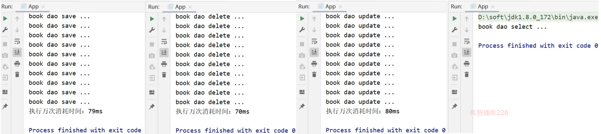

这里学习AOP编程,也就是所谓的面向切面编程

## Spring_day03

**今日目标**

> * 理解并掌握AOP相关概念
> * 能够说出AOP的工作流程
> * 能运用AOP相关知识完成对应的案例编写
> * 重点掌握Spring的声明式事务管理

## 1，AOP简介

前面我们在介绍Spring的时候说过，Spring有两个核心的概念，一个是`IOC/DI`，一个是`AOP`。

前面已经对`IOC/DI`进行了系统的学习，接下来要学习它的另一个核心内容，就是==AOP==。

对于AOP,我们前面提过一句话是:==AOP是在不改原有代码的前提下对其进行增强。==

对于下面的内容，我们主要就是围绕着这一句话进行展开学习，主要学习两方面内容`AOP核心概念`,`AOP作用`:

1.1 什么是AOP?

AOP(Aspect Oriented Programming)面向切面编程，一种编程范式，指导开发者如何组织程序结构。

前面已经对`IOC/DI`进行了系统的学习，接下来要学习它的另一个核心内容，就是==AOP==。

对于AOP,我们前面提过一句话是:==AOP是在不改原有代码的前提下对其进行增强。==

对于下面的内容，我们主要就是围绕着这一句话进行展开学习，主要学习两方面内容`AOP核心概念`,`AOP作用`:

### 1.1 什么是AOP?

- AOP(Aspect Oriented Programming)面向切面编程，一种编程范式，指导开发者如何组织程序结构。
  - OOP(Object Oriented Programming)面向对象编程

我们都知道OOP是一种编程思想，那么AOP也是一种编程思想，编程思想主要的内容就是指导程序员该如何编写程序，所以它们两个是不同的`编程范式`。

### 1.2 AOP作用

- 作用:在不惊动原始设计的基础上为其进行功能增强，前面咱们有技术就可以实现这样的功能即代理模式。

前面咱们有技术就可以实现这样的功能即`代理模式`。

#### AOP编程的作用

[面向切面编程](https://www.zhihu.com/search?q=面向切面编程&search_source=Entity&hybrid_search_source=Entity&hybrid_search_extra={"sourceType"%3A"answer"%2C"sourceId"%3A"48376158"})（AOP是Aspect Oriented Program的首字母缩写） ，我们知道，面向对象的特点是继承、多态和封装。而封装就要求将功能分散到不同的对象中去，这在软件设计中往往称为职责分配。实际上也就是说，让不同的类设计不同的方法。这样代码就分散到一个个的类中去了。这样做的好处是降低了代码的复杂程度，使类可重用。

但是人们也发现，在分散代码的同时，也增加了代码的重复性。什么意思呢？比如说，我们在两个类中，可能都需要在每个方法中做日志。按面向对象的设计方法，我们就必须在两个类的方法中都加入日志的内容。也许他们是完全相同的，但就是因为面向对象的设计让类与类之间无法联系，而不能将这些重复的代码统一起来。

也许有人会说，那好办啊，我们可以将这段代码写在一个独立的类独立的方法里，然后再在这两个类中调用。但是，这样一来，这两个类跟我们上面提到的独立的类就有耦合了，它的改变会影响这两个类。那么，有没有什么办法，能让我们在需要的时候，随意地加入代码呢？**这种在运行时，动态地将代码切入到类的指定方法、指定位置上的编程思想就是面向切面的编程。** 

一般而言，我们管切入到指定类指定方法的代码片段称为切面，而切入到哪些类、哪些方法则叫切入点。有了AOP，我们就可以把几个类共有的代码，抽取到一个切片中，等到需要时再切入对象中去，从而改变其原有的行为。

这样看来，AOP其实只是OOP的补充而已。OOP从横向上区分出一个个的类来，而AOP则从纵向上向对象中加入特定的代码。有了AOP，OOP变得立体了。如果加上[时间维度](https://www.zhihu.com/search?q=时间维度&search_source=Entity&hybrid_search_source=Entity&hybrid_search_extra={"sourceType"%3A"answer"%2C"sourceId"%3A"48376158"})，AOP使OOP由原来的二维变为三维了，由平面变成立体了。从技术上来说，AOP基本上是通过[代理机制](https://www.zhihu.com/search?q=代理机制&search_source=Entity&hybrid_search_source=Entity&hybrid_search_extra={"sourceType"%3A"answer"%2C"sourceId"%3A"48376158"})实现的。 

> AOP在编程历史上可以说是里程碑式的，对OOP编程是一种十分有益的补充。


### 1.3 AOP核心概念

为了能更好的理解AOP的相关概念，我们准备了一个环境，整个环境的内容我们暂时可以不用关注，最主要的类为:`BookDaoImpl`

```java
@Repository
public class BookDaoImpl implements BookDao {
    public void save() {
        //记录程序当前执行执行（开始时间）
        Long startTime = System.currentTimeMillis();
        //业务执行万次
        for (int i = 0;i<10000;i++) {
            System.out.println("book dao save ...");
        }
        //记录程序当前执行时间（结束时间）
        Long endTime = System.currentTimeMillis();
        //计算时间差
        Long totalTime = endTime-startTime;
        //输出信息
        System.out.println("执行万次消耗时间：" + totalTime + "ms");
    }
    public void update(){
        System.out.println("book dao update ...");
    }
    public void delete(){
        System.out.println("book dao delete ...");
    }
    public void select(){
        System.out.println("book dao select ...");
    }
}
```

代码的内容相信大家都能够读懂，对于`save`方法中有计算万次执行消耗的时间。

当在App类中从容器中获取bookDao对象后，分别执行其`save`,`delete`,`update`和`select`方法后会有如下的打印结果:



这个时候，我们就应该有些疑问?

对于计算万次执行消耗的时间只有save方法有，为什么delete和update方法也会有呢?

delete和update方法有，那什么select方法为什么又没有呢?

这个案例中其实就使用了Spring的AOP，在不惊动(改动)原有设计(代码)的前提下，想给谁添加功能就给谁添加。这个也就是Spring的理念：

(AOP编程,也就是在无入侵的基础上,抽离公共的代码,然后在需要的基础加上,即装饰器模式)

无入侵式/无侵入式

说了这么多，Spring到底是如何实现的呢?


(1)前面一直在强调，Spring的AOP是对一个类的方法在不进行任何修改的前提下实现增强。对于上面的案例中BookServiceImpl中有`save`,`update`,`delete`和`select`方法,这些方法我们给起了一个名字叫==连接点==

(2)在BookServiceImpl的四个方法中，`update`和`delete`只有打印没有计算万次执行消耗时间，但是在运行的时候已经有该功能，那也就是说`update`和`delete`方法都已经被增强，所以对于需要增强的方法我们给起了一个名字叫==切入点==

(3)执行BookServiceImpl的update和delete方法的时候都被添加了一个计算万次执行消耗时间的功能，将这个功能抽取到一个方法中，换句话说就是存放共性功能的方法，我们给起了个名字叫==通知==

(4)通知是要增强的内容，会有多个，**切入点**是需要被增强的方法，也会有多个，那哪个切入点需要添加哪个通知，就需要提前将它们之间的关系描述清楚，那么对于通知和切入点之间的关系描述，我们给起了个名字叫==切面==

(5)通知是一个方法，方法不能独立存在需要被写在一个类中，这个类我们也给起了个名字叫==通知类==

至此AOP中的核心概念就已经介绍完了，总结下:

* 连接点(JoinPoint)：程序执行过程中的任意位置，粒度为执行方法、抛出异常、设置变量等(也就是将要插入的位置是哪里)
  * 在SpringAOP中，理解为方法的执行
* 切入点(Pointcut):匹配连接点的式子
  * 在SpringAOP中，一个切入点可以描述一个具体方法，也可也匹配多个方法
    * 一个具体的方法:如com.itheima.dao包下的BookDao接口中的无形参无返回值的save方法
    * 匹配多个方法:所有的save方法，所有的get开头的方法，所有以Dao结尾的接口中的任意方法，所有带有一个参数的方法
  * 连接点范围要比切入点范围大，是切入点的方法也一定是连接点，但是是连接点的方法就不一定要被增强，所以可能不是切入点。
* 通知(Advice):在切入点处执行的操作，也就是共性功能
  * 在SpringAOP中，功能最终以方法的形式呈现
* 通知类：定义通知的类
* 切面(Aspect):描述通知与切入点的对应关系。

**小结**

这一节中主要讲解了AOP的概念与作用，以及AOP中的核心概念，学完以后大家需要能说出:

- 什么是AOP?
- AOP的作用是什么?
  - AOP中核心概念分别指的是什么?
  - 连接点
  - 切入点
  - 通知
  - 通知类
  - 切面

## 2，AOP入门案例

### 2.1 需求分析

案例设定：测算接口执行效率，但是这个案例稍微复杂了点，我们对其进行简化。

简化设定：在方法执行前输出当前系统时间。

对于SpringAOP的开发有两种方式，XML 和 ==注解==，我们使用哪个呢?

因为现在注解使用的比较多，所以本次课程就采用注解完成AOP的开发。

总结需求为:使用SpringAOP的注解方式完成在方法执行的前打印出当前系统时间。

### 2.2 思路分析

需求明确后，具体该如何实现，都有哪些步骤，我们先来分析下:

> 1.导入坐标(pom.xml)
>
> 2.制作连接点(原始操作，Dao接口与实现类)
>
> 3.制作共性功能(通知类与通知)
>
> 4.定义切入点
>
> 5.绑定切入点与通知关系(切面)

### 2.3 环境准备

* 创建一个Maven项目

* pom.xml添加Spring依赖

  ```xml
  <dependencies>
      <dependency>
          <groupId>org.springframework</groupId>
          <artifactId>spring-context</artifactId>
          <version>5.2.10.RELEASE</version>
      </dependency>
  </dependencies>
  ```

* 添加BookDao和BookDaoImpl类

  ```java
  public interface BookDao {
      public void save();
      public void update();
  }
  
  @Repository
  public class BookDaoImpl implements BookDao {
  
      public void save() {
          System.out.println(System.currentTimeMillis());
          System.out.println("book dao save ...");
      }
  
      public void update(){
          System.out.println("book dao update ...");
      }
  }
  ```

* 创建Spring的配置类

  ```java
  @Configuration
  @ComponentScan("com.itheima")
  public class SpringConfig {
  }
  ```

* 编写App运行类

  ```java
  public class App {
      public static void main(String[] args) {
          ApplicationContext ctx = new AnnotationConfigApplicationContext(SpringConfig.class);
          BookDao bookDao = ctx.getBean(BookDao.class);
          bookDao.save();
      }
  }
  ```


最终创建好的项目结构如下:


**说明:**

* 目前打印save方法的时候，因为方法中有打印系统时间，所以运行的时候是可以看到系统时间
* 对于update方法来说，就没有该功能
* 我们要使用SpringAOP的方式在不改变update方法的前提下让其具有打印系统时间的功能。

### 2.4 AOP实现步骤

#### 步骤1:添加依赖