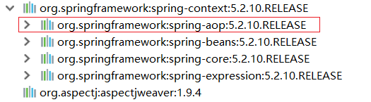
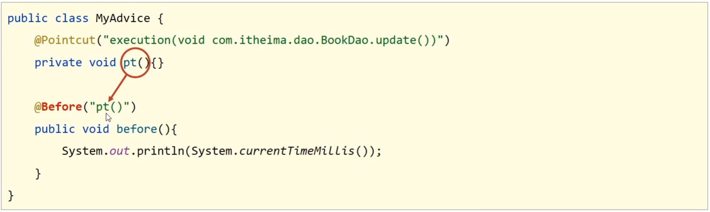
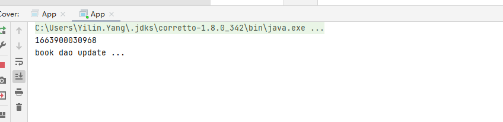
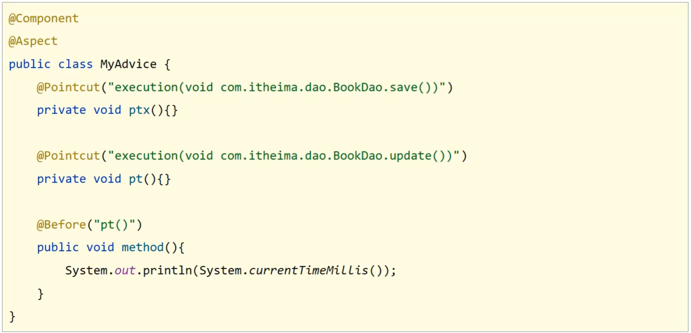
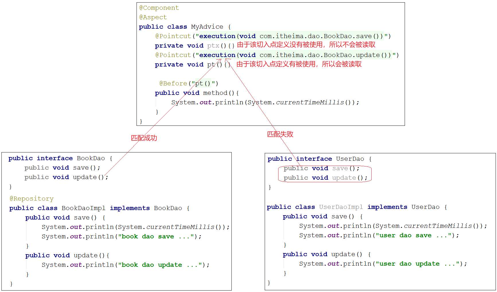
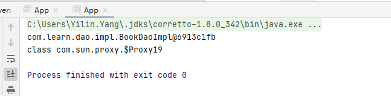
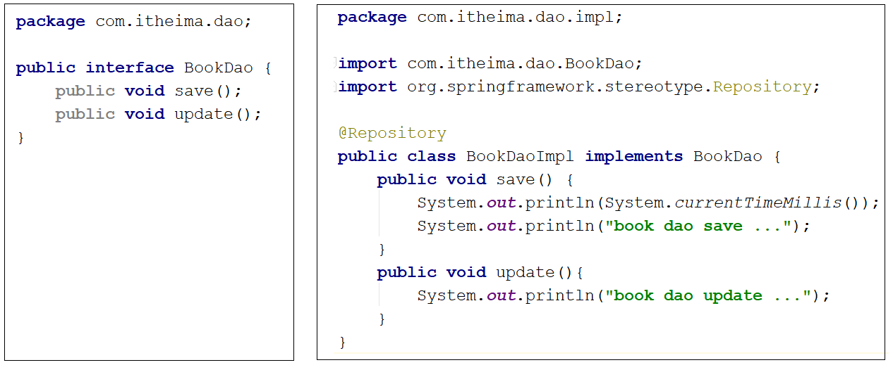

这里学习AOP编程,也就是所谓的面向切面编程

## Spring_day03

**今日目标**

> * 理解并掌握AOP相关概念
> * 能够说出AOP的工作流程
> * 能运用AOP相关知识完成对应的案例编写
> * 重点掌握Spring的声明式事务管理

## 1，AOP简介

前面我们在介绍Spring的时候说过，Spring有两个核心的概念，一个是`IOC/DI`，一个是`AOP`。

前面已经对`IOC/DI`进行了系统的学习，接下来要学习它的另一个核心内容，就是==AOP==。

对于AOP,我们前面提过一句话是:==AOP是在不改原有代码的前提下对其进行增强。==

对于下面的内容，我们主要就是围绕着这一句话进行展开学习，主要学习两方面内容`AOP核心概念`,`AOP作用`:

1.1 什么是AOP?

AOP(Aspect Oriented Programming)面向切面编程，一种编程范式，指导开发者如何组织程序结构。

前面已经对`IOC/DI`进行了系统的学习，接下来要学习它的另一个核心内容，就是==AOP==。

对于AOP,我们前面提过一句话是:==AOP是在不改原有代码的前提下对其进行增强。==

对于下面的内容，我们主要就是围绕着这一句话进行展开学习，主要学习两方面内容`AOP核心概念`,`AOP作用`:

### 1.1 什么是AOP?

- AOP(Aspect Oriented Programming)面向切面编程，一种编程范式，指导开发者如何组织程序结构。
  - OOP(Object Oriented Programming)面向对象编程

我们都知道OOP是一种编程思想，那么AOP也是一种编程思想，编程思想主要的内容就是指导程序员该如何编写程序，所以它们两个是不同的`编程范式`。

### 1.2 AOP作用

- 作用:在不惊动原始设计的基础上为其进行功能增强，前面咱们有技术就可以实现这样的功能即代理模式。

前面咱们有技术就可以实现这样的功能即`代理模式`。

#### AOP编程的作用

[面向切面编程](https://www.zhihu.com/search?q=面向切面编程&search_source=Entity&hybrid_search_source=Entity&hybrid_search_extra={"sourceType"%3A"answer"%2C"sourceId"%3A"48376158"})（AOP是Aspect Oriented Program的首字母缩写） ，我们知道，面向对象的特点是继承、多态和封装。而封装就要求将功能分散到不同的对象中去，这在软件设计中往往称为职责分配。实际上也就是说，让不同的类设计不同的方法。这样代码就分散到一个个的类中去了。这样做的好处是降低了代码的复杂程度，使类可重用。

但是人们也发现，在分散代码的同时，也增加了代码的重复性。什么意思呢？比如说，我们在两个类中，可能都需要在每个方法中做日志。按面向对象的设计方法，我们就必须在两个类的方法中都加入日志的内容。也许他们是完全相同的，但就是因为面向对象的设计让类与类之间无法联系，而不能将这些重复的代码统一起来。

也许有人会说，那好办啊，我们可以将这段代码写在一个独立的类独立的方法里，然后再在这两个类中调用。但是，这样一来，这两个类跟我们上面提到的独立的类就有耦合了，它的改变会影响这两个类。那么，有没有什么办法，能让我们在需要的时候，随意地加入代码呢？**这种在运行时，动态地将代码切入到类的指定方法、指定位置上的编程思想就是面向切面的编程。** 

一般而言，我们管切入到指定类指定方法的代码片段称为切面，而切入到哪些类、哪些方法则叫切入点。有了AOP，我们就可以把几个类共有的代码，抽取到一个切片中，等到需要时再切入对象中去，从而改变其原有的行为。

这样看来，AOP其实只是OOP的补充而已。OOP从横向上区分出一个个的类来，而AOP则从纵向上向对象中加入特定的代码。有了AOP，OOP变得立体了。如果加上[时间维度](https://www.zhihu.com/search?q=时间维度&search_source=Entity&hybrid_search_source=Entity&hybrid_search_extra={"sourceType"%3A"answer"%2C"sourceId"%3A"48376158"})，AOP使OOP由原来的二维变为三维了，由平面变成立体了。从技术上来说，AOP基本上是通过[代理机制](https://www.zhihu.com/search?q=代理机制&search_source=Entity&hybrid_search_source=Entity&hybrid_search_extra={"sourceType"%3A"answer"%2C"sourceId"%3A"48376158"})实现的。 

> AOP在编程历史上可以说是里程碑式的，对OOP编程是一种十分有益的补充。


### 1.3 AOP核心概念

为了能更好的理解AOP的相关概念，我们准备了一个环境，整个环境的内容我们暂时可以不用关注，最主要的类为:`BookDaoImpl`

```java
@Repository
public class BookDaoImpl implements BookDao {
    public void save() {
        //记录程序当前执行执行（开始时间）
        Long startTime = System.currentTimeMillis();
        //业务执行万次
        for (int i = 0;i<10000;i++) {
            System.out.println("book dao save ...");
        }
        //记录程序当前执行时间（结束时间）
        Long endTime = System.currentTimeMillis();
        //计算时间差
        Long totalTime = endTime-startTime;
        //输出信息
        System.out.println("执行万次消耗时间：" + totalTime + "ms");
    }
    public void update(){
        System.out.println("book dao update ...");
    }
    public void delete(){
        System.out.println("book dao delete ...");
    }
    public void select(){
        System.out.println("book dao select ...");
    }
}
```

代码的内容相信大家都能够读懂，对于`save`方法中有计算万次执行消耗的时间。

当在App类中从容器中获取bookDao对象后，分别执行其`save`,`delete`,`update`和`select`方法后会有如下的打印结果:


这个时候，我们就应该有些疑问?

对于计算万次执行消耗的时间只有save方法有，为什么delete和update方法也会有呢?

delete和update方法有，那什么select方法为什么又没有呢?

这个案例中其实就使用了Spring的AOP，在不惊动(改动)原有设计(代码)的前提下，想给谁添加功能就给谁添加。这个也就是Spring的理念：

(AOP编程,也就是在无入侵的基础上,抽离公共的代码,然后在需要的基础加上,即装饰器模式)

无入侵式/无侵入式

说了这么多，Spring到底是如何实现的呢?


(1)前面一直在强调，Spring的AOP是对一个类的方法在不进行任何修改的前提下实现增强。对于上面的案例中BookServiceImpl中有`save`,`update`,`delete`和`select`方法,这些方法我们给起了一个名字叫==连接点==

(2)在BookServiceImpl的四个方法中，`update`和`delete`只有打印没有计算万次执行消耗时间，但是在运行的时候已经有该功能，那也就是说`update`和`delete`方法都已经被增强，所以对于需要增强的方法我们给起了一个名字叫==切入点==

(3)执行BookServiceImpl的update和delete方法的时候都被添加了一个计算万次执行消耗时间的功能，将这个功能抽取到一个方法中，换句话说就是存放共性功能的方法，我们给起了个名字叫==通知==

(4)通知是要增强的内容，会有多个，**切入点**是需要被增强的方法，也会有多个，那哪个切入点需要添加哪个通知，就需要提前将它们之间的关系描述清楚，那么对于通知和切入点之间的关系描述，我们给起了个名字叫==切面==

(5)通知是一个方法，方法不能独立存在需要被写在一个类中，这个类我们也给起了个名字叫==通知类==

至此AOP中的核心概念就已经介绍完了，总结下:

* 连接点(JoinPoint)：程序执行过程中的任意位置，粒度为执行方法、抛出异常、设置变量等(也就是将要插入的位置是哪里)
  * 在SpringAOP中，理解为方法的执行
* 切入点(Pointcut):匹配连接点的式子
  * 在SpringAOP中，一个切入点可以描述一个具体方法，也可也匹配多个方法
    * 一个具体的方法:如com.itheima.dao包下的BookDao接口中的无形参无返回值的save方法
    * 匹配多个方法:所有的save方法，所有的get开头的方法，所有以Dao结尾的接口中的任意方法，所有带有一个参数的方法
  * 连接点范围要比切入点范围大，是切入点的方法也一定是连接点，但是是连接点的方法就不一定要被增强，所以可能不是切入点。
* 通知(Advice):在切入点处执行的操作，也就是共性功能
  * 在SpringAOP中，功能最终以方法的形式呈现
* 通知类：定义通知的类
* 切面(Aspect):描述通知与切入点的对应关系。

**小结**

这一节中主要讲解了AOP的概念与作用，以及AOP中的核心概念，学完以后大家需要能说出:

- 什么是AOP?
- AOP的作用是什么?
  - AOP中核心概念分别指的是什么?
  - 连接点
  - 切入点
  - 通知
  - 通知类
  - 切面

## 2，AOP入门案例

### 2.1 需求分析

案例设定：测算接口执行效率，但是这个案例稍微复杂了点，我们对其进行简化。

简化设定：在方法执行前输出当前系统时间。

对于SpringAOP的开发有两种方式，XML 和 ==注解==，我们使用哪个呢?

因为现在注解使用的比较多，所以本次课程就采用注解完成AOP的开发。

总结需求为:使用SpringAOP的注解方式完成在方法执行的前打印出当前系统时间。

### 2.2 思路分析

需求明确后，具体该如何实现，都有哪些步骤，我们先来分析下:

> 1.导入坐标(pom.xml)
>
> 2.制作连接点(原始操作，Dao接口与实现类)
>
> 3.制作共性功能(通知类与通知)
>
> 4.定义切入点
>
> 5.绑定切入点与通知关系(切面)

### 2.3 环境准备

* 创建一个Maven项目

* pom.xml添加Spring依赖

  ```xml
  <dependencies>
      <dependency>
          <groupId>org.springframework</groupId>
          <artifactId>spring-context</artifactId>
          <version>5.2.10.RELEASE</version>
      </dependency>
  </dependencies>
  ```

* 添加BookDao和BookDaoImpl类

  ```java
  public interface BookDao {
      public void save();
      public void update();
  }
  
  @Repository
  public class BookDaoImpl implements BookDao {
  
      public void save() {
          System.out.println(System.currentTimeMillis());
          System.out.println("book dao save ...");
      }
  
      public void update(){
          System.out.println("book dao update ...");
      }
  }
  ```

* 创建Spring的配置类

  ```java
  @Configuration
  @ComponentScan("com.itheima")
  public class SpringConfig {
  }
  ```

* 编写App运行类

  ```java
  public class App {
      public static void main(String[] args) {
          ApplicationContext ctx = new AnnotationConfigApplicationContext(SpringConfig.class);
          BookDao bookDao = ctx.getBean(BookDao.class);
          bookDao.save();
      }
  }
  ```


最终创建好的项目结构如下:


**说明:**

* 目前打印save方法的时候，因为方法中有打印系统时间，所以运行的时候是可以看到系统时间
* 对于update方法来说，就没有该功能
* 我们要使用SpringAOP的方式在不改变update方法的前提下让其具有打印系统时间的功能。

### 2.4 AOP实现步骤

#### 步骤1:添加依赖

pom.xml

```xml
<dependency>
    <groupId>org.aspectj</groupId>
    <artifactId>aspectjweaver</artifactId>
    <version>1.9.4</version>
</dependency>
```



因为`spring-context`中已经导入了`spring-aop`,所以不需要再单独导入`spring-aop`

导入AspectJ的jar包,AspectJ是AOP思想的一个具体实现，Spring有自己的AOP实现，但是相比于AspectJ来说比较麻烦，所以我们直接采用Spring整合ApsectJ的方式进行AOP开发。

#### 步骤2:定义接口与实现类

```java
环境准备的时候，BookDaoImpl已经准备好，不需要做任何修改
```

#### 步骤3:定义通知类和通知

通知就是将共性功能抽取出来后形成的方法，共性功能指的就是当前系统时间的打印。

```java
public class MyAdvice {
    public void method(){
        System.out.println(System.currentTimeMillis());
    }
}
```

类名和方法名没有要求，可以任意。

#### 步骤4:定义切入点

BookDaoImpl中有两个方法，分别是save和update，我们要增强的是update方法，该如何定义呢?

```java
public class MyAdvice {
    @Pointcut("execution(void com.itheima.dao.BookDao.update())")
    private void pt(){}
    public void method(){
        System.out.println(System.currentTimeMillis());
    }
}
```

**说明:**

* 切入点定义依托一个不具有实际意义的方法进行，即无参数、无返回值、方法体无实际逻辑。
* execution及后面编写的内容，后面会有章节专门去学习。

#### 步骤5:制作切面

切面是用来描述通知和切入点之间的关系，如何进行关系的绑定?

```java
public class MyAdvice {
    @Pointcut("execution(void com.itheima.dao.BookDao.update())")
    private void pt(){}
    
    @Before("pt()")
    public void method(){
        System.out.println(System.currentTimeMillis());
    }
}
```

绑定切入点与通知关系，并指定通知添加到原始连接点的具体执行==位置==



**说明:**@Before翻译过来是之前，也就是说通知会在切入点方法执行之前执行，除此之前还有其他四种类型，后面会讲。

#### 步骤6:将通知类配给容器并标识其为切面类

```java
@Component
@Aspect
public class MyAdvice {
    @Pointcut("execution(void com.itheima.dao.BookDao.update())")
    private void pt(){}
    
    @Before("pt()")
    public void method(){
        System.out.println(System.currentTimeMillis());
    }
}
```

#### 步骤7:开启注解格式AOP功能

```java
@Configuration
@ComponentScan("com.itheima")
@EnableAspectJAutoProxy
public class SpringConfig {
}
```

#### 步骤8:运行程序

```java
public class App {
    public static void main(String[] args) {
        ApplicationContext ctx = new AnnotationConfigApplicationContext(SpringConfig.class);
        BookDao bookDao = ctx.getBean(BookDao.class);
        bookDao.update();
    }
}
```

看到在执行update方法之前打印了系统时间戳，说明对原始方法进行了增强，AOP编程成功。



### 知识点1：@EnableAspectJAutoProxy  

| 名称 | @EnableAspectJAutoProxy |
| ---- | ----------------------- |
| 类型 | 配置类注解              |
| 位置 | 配置类定义上方          |
| 作用 | 开启注解格式AOP功能     |

### 知识点2：@Aspect

| 名称 | @Aspect               |
| ---- | --------------------- |
| 类型 | 类注解                |
| 位置 | 切面类定义上方        |
| 作用 | 设置当前类为AOP切面类 |

### 知识点3：@Pointcut   

| 名称 | @Pointcut                   |
| ---- | --------------------------- |
| 类型 | 方法注解                    |
| 位置 | 切入点方法定义上方          |
| 作用 | 设置切入点方法              |
| 属性 | value（默认）：切入点表达式 |

### 知识点4：@Before

| 名称 | @Before                                |
| ---- | -------------------------------------- |
| 类型 | 方法注解                               |
| 位置 | 通知方法定义上方                       |
| 作用 | 设置当前通知方法与切入点之间的绑定关系 |

总共要记住以下

`EnableAspectJAutoProxy`是一个`配置类注解`加在`config`上的注解,这个注解的作用是开启AOP的注解格式

`Aspect`是一个类注解,作用是将当前类设置为一个切面类

`Pointcut   `作用是设置一个切入点

`Before`作用是设置设置在之前

整个设置切面的过程为

1. 设置切面的相关配置文件(aspect-j)
2. 定义相关接口和实现类(要切面的对象)
3. 定义共性功能(在aop类,定义要切入的方法和功能)
4. 定义切入点(要在那个方法或者地方切入@Pointcut来设定切入地方)
5. 定义切面(设置了要切入的方法或者地方,现在具体的设置在方法或者哪里之前之后)
6. 在springconfig上添加开启aop注解,并且注意还要把之前的切面类标识为切面类(@Component和@Aspect)

## 3，AOP工作流程

AOP的入门案例已经完成，对于刚才案例的执行过程，我们就得来分析分析，这一节我们主要讲解两个知识点:`AOP工作流程`和`AOP核心概念`。其中核心概念是对前面核心概念的补充。

### 3.1 AOP工作流程

由于AOP是基于Spring容器管理的bean做的增强，所以整个工作过程需要从Spring加载bean说起:

#### 流程1:Spring容器启动

* 容器启动就需要去加载bean,哪些类需要被加载呢?
* 需要被增强的类，如:BookServiceImpl
* 通知类，如:MyAdvice
* 注意此时bean对象还没有创建成功

#### 流程2:读取所有切面配置中的切入点



上面这个例子中有两个切入点的配置，但是第一个`ptx()`并没有被使用，所以不会被读取。

#### 流程3:初始化bean，

判定bean对应的类中的方法是否匹配到任意切入点

- 注意第1步在容器启动的时候，bean对象还没有被创建成功。
- 要被实例化bean对象的类中的方法和切入点进行匹配



- 匹配失败，创建原始对象,如`UserDao`
  - 匹配失败,说明不需要增强，直接调用原始对象的方法即可。
- 匹配成功，创建原始对象（==目标对象==）的==代理==对象,如:`BookDao`
  - 匹配成功说明需要对其进行增强
  - 对哪个类做增强，这个类对应的对象就叫做目标对象
  - 因为要对目标对象进行功能增强，而采用的技术是动态代理，所以会为其创建一个代理对象
  - 最终运行的是代理对象的方法，在该方法中会对原始方法进行功能增强

#### 流程4:获取bean执行方法

- 获取的bean是原始对象时，调用方法并执行，完成操作
- 获取的bean是代理对象时，根据代理对象的运行模式运行原始方法与增强的内容，完成操作

#### 验证容器中是否为代理对象

为了验证IOC容器中创建的对象和我们刚才所说的结论是否一致，首先先把结论理出来:

- 如果目标对象中的方法会被增强，那么容器中将存入的是目标对象的代理对象
- 如果目标对象中的方法不被增强，那么容器中将存入的是目标对象本身。

##### 验证思路

> 1.要执行的方法，不被定义的切入点包含，即不要增强，打印当前类的getClass()方法
>
> 2.要执行的方法，被定义的切入点包含，即要增强，打印出当前类的getClass()方法
>
> 3.观察两次打印的结果

##### 步骤1:修改App类,获取类的类型

```java
public class App {
    public static void main(String[] args) {
        ApplicationContext ctx = new AnnotationConfigApplicationContext(SpringConfig.class);
        BookDao bookDao = ctx.getBean(BookDao.class);
        System.out.println(bookDao);
        System.out.println(bookDao.getClass());
    }
}
```

##### 步骤2:修改MyAdvice类，不增强

因为定义的切入点中，被修改成`update1`,所以BookDao中的update方法在执行的时候，就不会被增强，

所以容器中的对象应该是目标对象本身。

```java
@Component
@Aspect
public class MyAdvice {
    @Pointcut("execution(void com.itheima.dao.BookDao.update1())")
    private void pt(){}
    
    @Before("pt()")
    public void method(){
        System.out.println(System.currentTimeMillis());
    }
}
```

打印出来的结果。




证明了,如果目标对象被增强,那么容器中将存入的是目标对象的==代理对象==

不能直接打印对象，从上面两次结果中可以看出，直接打印对象走的是对象的toString方法，不管是不是代理对象打印的结果都是一样的，原因是==内部对toString方法进行了重写==。

### 3.2 AOP核心概念

在上面介绍AOP的工作流程中，我们提到了两个核心概念，分别是:

- 目标对象(Target)：原始功能去掉共性功能对应的类产生的对象，这种对象是无法直接完成最终工作的
- 代理(Proxy)：目标对象无法直接完成工作，需要对其进行功能回填，通过原始对象的代理对象实现

上面这两个概念比较抽象，简单来说，

目标对象就是要增强的类[如:BookServiceImpl类]对应的对象，也叫原始对象，不能说它不能运行，只能说它在运行的过程中对于要增强的内容是缺失的。

SpringAOP是在不改变原有设计(代码)的前提下对其进行增强的，它的底层采用的是代理模式实现的，所以要对原始对象进行增强，就需要对原始对象创建代理对象，在代理对象中的方法把通知[如:MyAdvice中的method方法]内容加进去，就实现了增强,这就是我们所说的代理(Proxy)。

**小结**

通过这一节中，我们需要掌握的内容有：

* 能说出AOP的工作流程
* AOP的核心概念
  * 目标对象、连接点、切入点
  * 通知类、通知
  * 切面
  * 代理
* SpringAOP的本质或者可以说底层实现是通过代理模式。

## 4，AOP配置管理

### 4.1 AOP切入点表达式

前面的案例中，有涉及到如下内容:


对于AOP中切入点表达式，我们总共会学习三个内容，分别是`语法格式`、`通配符`和`书写技巧`。

#### 4.1.1 语法格式

首先我们先要明确两个概念:

* 切入点:要进行增强的方法
* 切入点表达式:要进行增强的方法的描述方式

对于切入点的描述，我们其实是有两种方式的，先来看下前面的例子


描述方式一：执行com.itheima.dao包下的BookDao接口中的无参数update方法

```java
execution(void com.itheima.dao.BookDao.update())
```

描述方式二：执行com.itheima.dao.impl包下的BookDaoImpl类中的无参数update方法

```
execution(void com.itheima.dao.impl.BookDaoImpl.update())
```

因为调用接口方法的时候最终运行的还是其实现类的方法，所以上面两种描述方式都是可以的。

对于切入点表达式的语法为:

切入点表达式标准格式：动作关键字(访问修饰符  返回值  包名.类/接口名.方法名(参数) 异常名）

对于这个格式，我们不需要硬记，通过一个例子，理解它:

```java
execution(public User com.itheima.service.UserService.findById(int))
```

- execution：动作关键字，描述切入点的行为动作，例如execution表示执行到指定切入点
- public:访问修饰符,还可以是public，private等，可以省略
- User：返回值，写返回值类型
- com.itheima.service：包名，多级包使用点连接
- UserService:类/接口名称
- findById：方法名
- int:参数，直接写参数的类型，多个类型用逗号隔开
- 异常名：方法定义中抛出指定异常，可以省略

切入点表达式就是要找到需要增强的方法，所以它就是对一个具体方法的描述，但是方法的定义会有很多，所以如果每一个方法对应一个切入点表达式，想想这块就会觉得将来编写起来会比较麻烦，有没有更简单的方式呢?

就需要用到下面所学习的通配符。

#### 4.1.2 通配符

我们使用通配符描述切入点，主要的目的就是简化之前的配置，具体都有哪些通配符可以使用?

* `*`:单个独立的任意符号，可以独立出现，也可以作为前缀或者后缀的匹配符出现

```java
execution（public * com.itheima.*.UserService.find*(*))
```

匹配com.itheima包下的任意包中的UserService类或接口中所有find开头的带有一个参数的方法

- `..`：多个连续的任意符号，可以独立出现，常用于简化包名与参数的书写

```java
execution（public User com..UserService.findById(..))
```

匹配com包下的任意包中的UserService类或接口中所有名称为findById的方法

`+`：专用于匹配子类类型

```java
execution(* *..*Service+.*(..))
```

这个使用率较低，描述子类的，咱们做JavaEE开发，继承机会就一次，使用都很慎重，所以很少用它。*Service+，表示所有以Service结尾的接口的子类。

(*代表匹配任意,至少有一个参数,..代表匹配任意多个)

`execution（public * com.itheima.*.UserService.find*(*))`

(匹配任意个返回类型,com.itheima下的,任意的,UserService下的find方法,包含任意参数)

接下来，我们把案例中使用到的切入点表达式来分析下:



```java
execution(void com.itheima.dao.BookDao.update())
匹配接口，能匹配到
execution(void com.itheima.dao.impl.BookDaoImpl.update())
匹配实现类，能匹配到
execution(* com.itheima.dao.impl.BookDaoImpl.update())
返回值任意，能匹配到
execution(* com.itheima.dao.impl.BookDaoImpl.update(*))
返回值任意，但是update方法必须要有一个参数，无法匹配，要想匹配需要在update接口和实现类添加参数
execution(void com.*.*.*.*.update())
返回值为void,com包下的任意包三层包下的任意类的update方法，匹配到的是实现类，能匹配
execution(void com.*.*.*.update())
返回值为void,com包下的任意两层包下的任意类的update方法，匹配到的是接口，能匹配
execution(void *..update())
返回值为void，方法名是update的任意包下的任意类，能匹配
execution(* *..*(..))
匹配项目中任意类的任意方法，能匹配，但是不建议使用这种方式，影响范围广
execution(* *..u*(..))
匹配项目中任意包任意类下只要以u开头的方法，update方法能满足，能匹配
execution(* *..*e(..))
匹配项目中任意包任意类下只要以e结尾的方法，update和save方法能满足，能匹配
execution(void com..*())
返回值为void，com包下的任意包任意类任意方法，能匹配，*代表的是方法
execution(* com.itheima.*.*Service.find*(..))
将项目中所有业务层方法的以find开头的方法匹配
execution(* com.itheima.*.*Service.save*(..))
将项目中所有业务层方法的以save开头的方法匹配
```

后面两种更符合我们平常切入点表达式的编写规则

#### 4.1.3 书写技巧

对于切入点表达式的编写其实是很灵活的，那么在编写的时候，有没有什么好的技巧让我们用用:

- 所有代码按照标准规范开发，否则以下技巧全部失效
- 描述切入点通**==常描述接口==**，而不描述实现类,如果描述到实现类，就出现紧耦合了
- 访问控制修饰符针对接口开发均采用public描述（**==可省略访问控制修饰符描述==**）
- 返回值类型对于增删改类使用精准类型加速匹配，对于查询类使用\*通配快速描述
- **==包名==**书写**==尽量不使用..匹配==**，效率过低，常用\*做单个包描述匹配，或精准匹配
- **==接口名/类名==**书写名称与模块相关的**==采用\*匹配==**，例如UserService书写成\*Service，绑定业务层接口名
- **==方法名==**书写以**==动词==**进行**==精准匹配==**，名词采用*匹配，例如getById书写成getBy*,selectAll书写成selectAll
- 参数规则较为复杂，根据业务方法灵活调整
- 通常**==不使用异常==**作为**==匹配==**规则

(*代表匹配任意,至少有一个参数,..代表匹配任意多个)