## Maven高级

**今日目标**

> * 理解并实现分模块开发
> * 能够使用聚合工程快速构建项目
> * 能够使用继承简化项目配置
> * 能够根据需求配置生成、开发、测试环境，并在各个环境间切换运行
> * 了解Maven的私服

## 1，分模块开发

### 1.1 分模块开发设计

(1)按照功能拆分

我们现在的项目都是在一个模块中，比如前面的SSM整合开发。虽然这样做功能也都实现了，但是也存在了一些问题，我们拿银行的项目为例来聊聊这个事。

* 网络没有那么发达的时候，我们需要到银行柜台或者取款机进行业务操作
* 随着互联网的发展,我们有了电脑以后，就可以在网页上登录银行网站使用U盾进行业务操作
* 再来就是随着智能手机的普及，我们只需要用手机登录APP就可以进行业务操作

上面三个场景出现的时间是不相同的，如果非要把三个场景的模块代码放入到一个项目，那么当其中某一个模块代码出现问题，就会导致整个项目无法正常启动，从而导致银行的多个业务都无法正常班理。所以我们会==按照功能==将项目进行拆分。

(2)按照模块拆分

比如电商的项目中，有订单和商品两个模块，订单中需要包含商品的详细信息，所以需要商品的模型类，商品模块也会用到商品的模型类，这个时候如果两个模块中都写模型类，就会出现重复代码，后期的维护成本就比较高。我们就想能不能将它们公共的部分抽取成一个独立的模块，其他模块要想使用可以像添加第三方jar包依赖一样来使用我们自己抽取的模块，这样就解决了代码重复的问题,这种拆分方式就说我们所说的==按照模块==拆分。

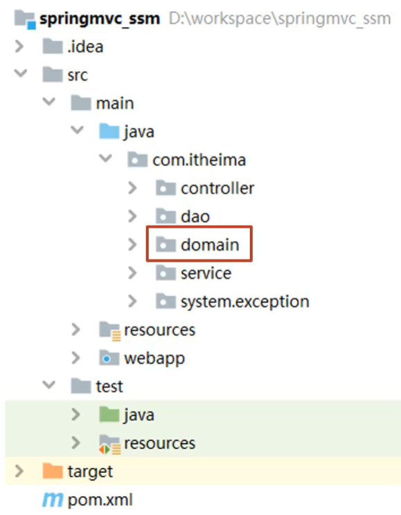

经过两个案例的分析，我们就知道:

* 将原始模块按照功能拆分成若干个子模块，方便模块间的相互调用，接口共享。

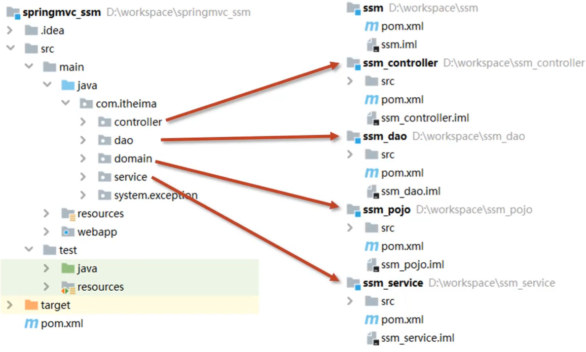

这样的话，项目中的每一层都可以单独维护，也可以很方便的被别人使用。关于分模块开发的意义，我们就说完了，说了这么多好处，那么该如何实现呢?

### 1.2 分模块开发实现

前面我们已经完成了SSM整合，接下来，咱们就基于SSM整合的项目来实现对项目的拆分。

#### 1.2.1 环境准备

将`资料\maven_02_ssm`部署到IDEA中，将环境快速准备好，部署成功后，项目的格式如下:

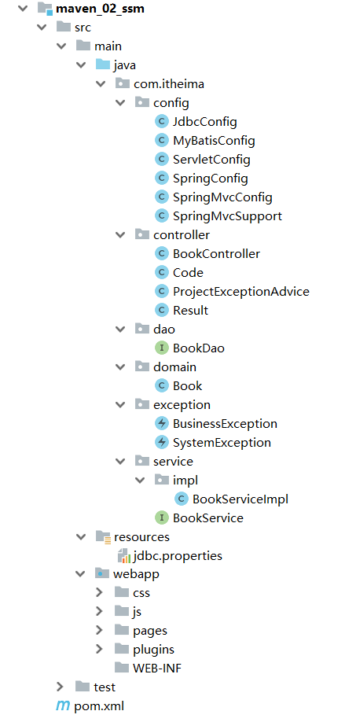

#### 1.2.2 抽取domain层

##### 步骤1:创建新模块

创建一个名称为`maven_03_pojo`的jar项目,为什么项目名是从02到03这样创建，原因后面我们会提到，这块的名称可以任意。

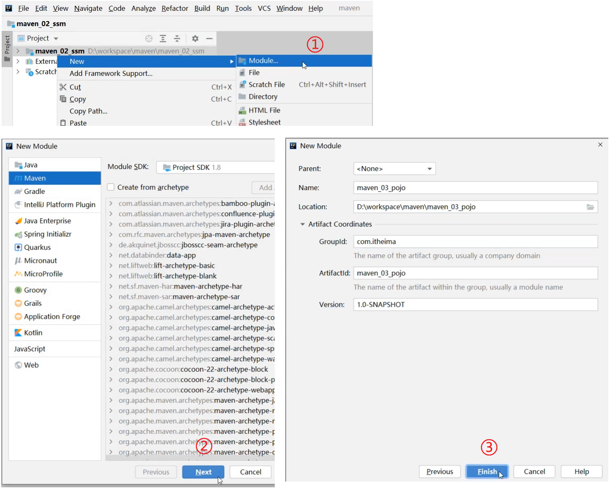

##### 步骤2:项目中创建domain包

在`maven_03_pojo`项目中创建`com.itheima.domain`包，并将`maven_02_ssm`中Book类拷贝到该包中

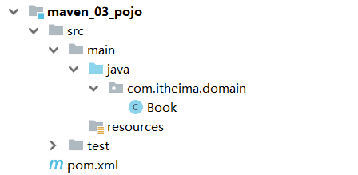

##### 步骤3:删除原项目中的domain包

删除后，`maven_02_ssm`项目中用到`Book`的类中都会有红色提示，如下:

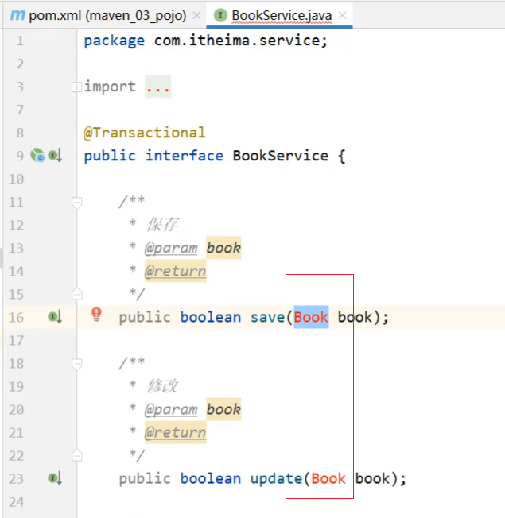

**说明:**出错的原因是`maven_02_ssm`中已经将Book类删除，所以该项目找不到Book类，所以报错

要想解决上述问题，我们需要在`maven_02_ssm`中添加`maven_03_pojo`的依赖。

##### 步骤4:建立依赖关系

在`maven_02_ssm`项目的pom.xml添加`maven_03_pojo`的依赖

```xml
<dependency>
    <groupId>com.itheima</groupId>
    <artifactId>maven_03_pojo</artifactId>
    <version>1.0-SNAPSHOT</version>
</dependency>
```

因为添加了依赖，所以在`maven_02_ssm`中就已经能找到Book类，所以刚才的报红提示就会消失。

##### 步骤5:编译`maven_02_ssm`项目

编译`maven_02_ssm`你会在控制台看到如下错误

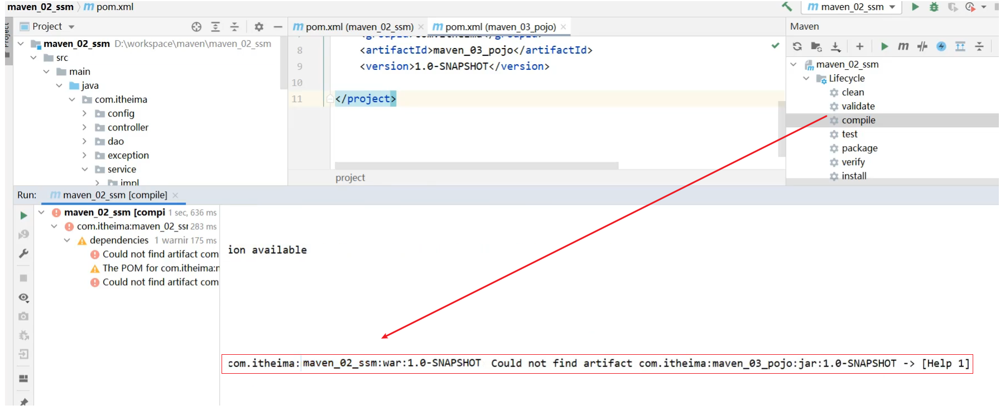

错误信息为：不能解决`maven_02_ssm`项目的依赖问题，找不到`maven_03_pojo`这个jar包。

为什么找不到呢?

原因是Maven会从本地仓库找对应的jar包，但是本地仓库又不存在该jar包所以会报错。

在IDEA中是有`maven_03_pojo`这个项目，所以我们只需要将`maven_03_pojo`项目安装到本地仓库即可。

##### 步骤6:将项目安装本地仓库

将需要被依赖的项目`maven_03_pojo`，使用maven的install命令，把其安装到Maven的本地仓库中。


安装成功后，在对应的路径下就看到安装好的jar包

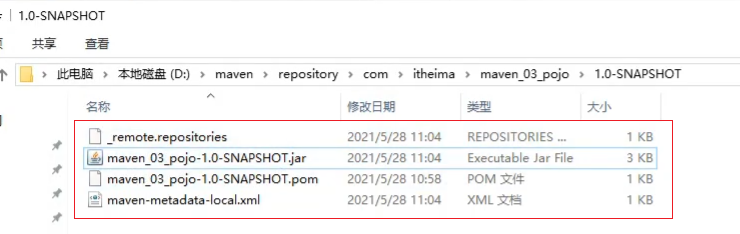

**说明:**具体安装在哪里，和你们自己电脑上Maven的本地仓库配置的位置有关。

当再次执行`maven_02_ssm`的compile的命令后，就已经能够成功编译。

#### 1.2.3 抽取Dao层

##### 步骤1:创建新模块

创建一个名称为`maven_04_dao`的jar项目

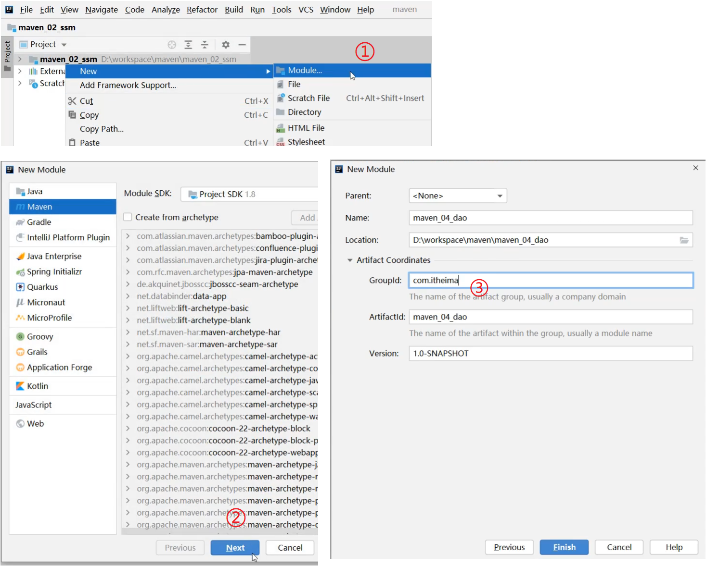

##### 步骤2:项目中创建dao包

在`maven_04_dao`项目中创建`com.itheima.dao`包，并将`maven_02_ssm`中BookDao类拷贝到该包中

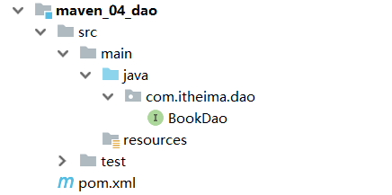

在`maven_04_dao`中会有如下几个问题需要解决下:

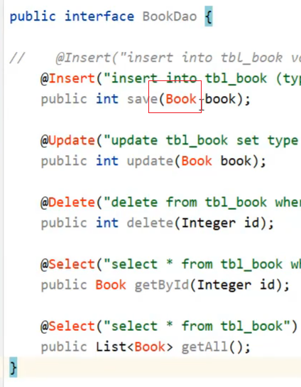

* 项目`maven_04_dao`的BookDao接口中Book类找不到报错

  * 解决方案在`maven_04_dao`项目的pom.xml中添加`maven_03_pojo`项目

    ```xml
    <dependencies>
        <dependency>
            <groupId>com.itheima</groupId>
            <artifactId>maven_03_pojo</artifactId>
            <version>1.0-SNAPSHOT</version>
        </dependency>
    </dependencies>
    ```

* 项目`maven_04_dao`的BookDao接口中，Mybatis的增删改查注解报错

  * 解决方案在`maven_04_dao`项目的pom.xml中添加`mybatis`的相关依赖

    ```xml
    <dependencies>
        <dependency>
            <groupId>org.mybatis</groupId>
            <artifactId>mybatis</artifactId>
            <version>3.5.6</version>
        </dependency>
    
        <dependency>
            <groupId>mysql</groupId>
            <artifactId>mysql-connector-java</artifactId>
            <version>5.1.47</version>
        </dependency>
    </dependencies>
    ```

##### 步骤3:删除原项目中的dao包

删除Dao包以后，因为`maven_02_ssm`中的BookServiceImpl类中有使用到Dao的内容，所以需要在`maven_02_ssm`的pom.xml添加`maven_04_dao`的依赖

```xml
<dependency>
    <groupId>com.itheima</groupId>
    <artifactId>maven_04_dao</artifactId>
    <version>1.0-SNAPSHOT</version>
</dependency>
```

此时在`maven_02_ssm`项目中就已经添加了`maven_03_pojo`和`maven_04_dao`包

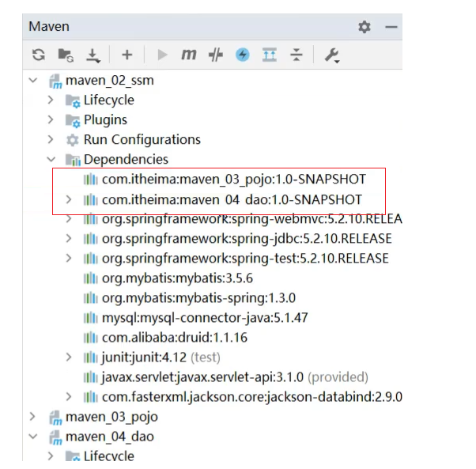

再次对`maven_02_ssm`项目进行编译，又会报错，如下:

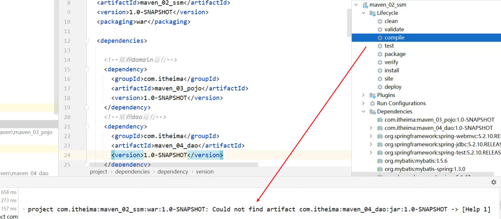

和刚才的错误原因是一样的，maven在仓库中没有找到`maven_04_dao`,所以此时我们只需要将`maven_04_dao`安装到Maven的本地仓库即可。

##### 步骤4:将项目安装到本地仓库

将需要被依赖的项目`maven_04_dao`，使用maven的install命令，把其安装到Maven的本地仓库中。

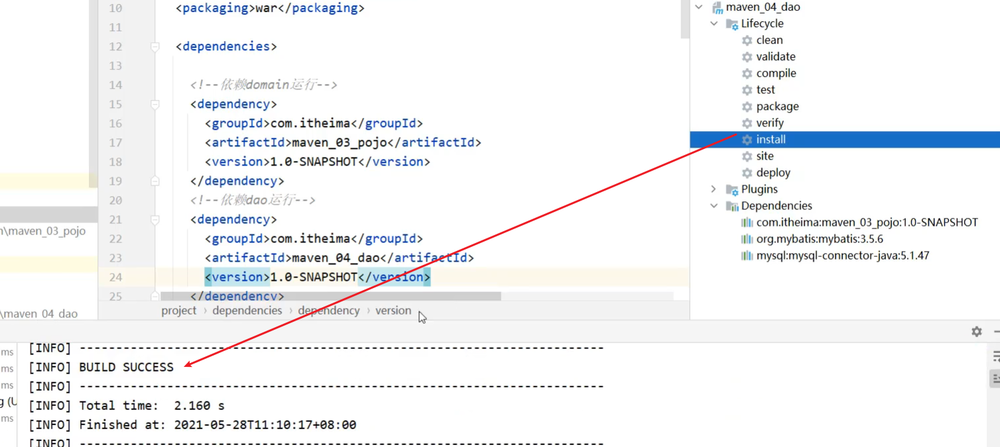

安装成功后，在对应的路径下就看到了安装好对应的jar包

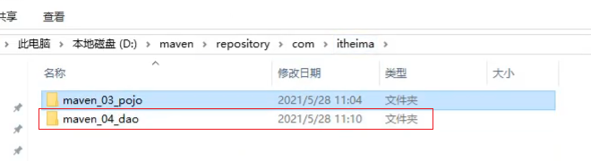

当再次执行`maven_02_ssm`的compile的指令后，就已经能够成功编译。

#### 1.2.4 运行测试并总结

将抽取后的项目进行运行，测试之前的增删改查功能依然能够使用。

所以对于项目的拆分，大致会有如下几个步骤:

(1) 创建Maven模块

(2) 书写模块代码

分模块开发需要先针对模块功能进行设计，再进行编码。不会先将工程开发完毕，然后进行拆分。拆分方式可以按照功能拆也可以按照模块拆。

(3)通过maven指令安装模块到本地仓库(install 指令)

团队内部开发需要发布模块功能到团队内部可共享的仓库中(私服)，私服我们后面会讲解。

## 2，依赖管理

我们现在已经能把项目拆分成一个个独立的模块，当在其他项目中想要使用独立出来的这些模块，只需要在其pom.xml使用<dependency>标签来进行jar包的引入即可。

<dependency>其实就是依赖，关于依赖管理里面都涉及哪些内容，我们就一个个来学习下:

* 依赖传递
* 可选依赖
* 排除依赖

我们先来说说什么是依赖:

依赖指当前项目运行所需的jar，一个项目可以设置多个依赖。

格式为:

```xml
<!--设置当前项目所依赖的所有jar-->
<dependencies>
    <!--设置具体的依赖-->
    <dependency>
        <!--依赖所属群组id-->
        <groupId>org.springframework</groupId>
        <!--依赖所属项目id-->
        <artifactId>spring-webmvc</artifactId>
        <!--依赖版本号-->
        <version>5.2.10.RELEASE</version>
    </dependency>
</dependencies>
```

### 2.1 依赖传递与冲突问题

回到我们刚才的项目案例中，打开Maven的面板，你会发现:

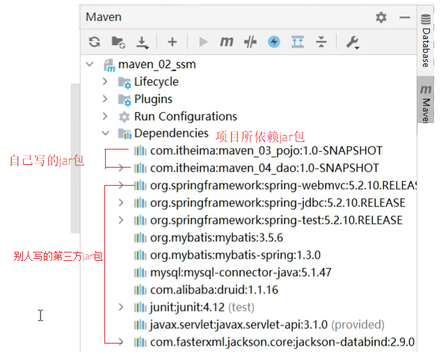

在项目所依赖的这些jar包中，有一个比较大的区别就是**有的依赖前面有箭头`>`,有的依赖前面没有。**

那么这个箭头所代表的含义是什么?

打开前面的箭头，你会发现这个jar包下面还包含有其他的jar包


你会发现有两个`maven_03_pojo`的依赖被加载到Dependencies中，那么`maven_04_dao`中的`maven_03_pojo`能不能使用呢?

要想验证非常简单，只需要把`maven_02_ssm`项目中pom.xml关于`maven_03_pojo`的依赖注释或删除掉

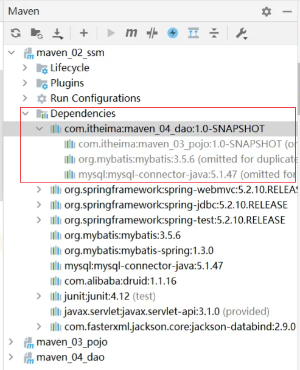

在Dependencies中移除自己所添加`maven_03_pojo`依赖后，打开BookServiceImpl的类，你会发现Book类依然存在，可以被正常使用

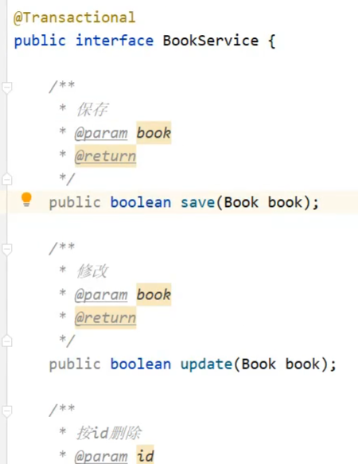

这个特性其实就是我们要讲解的==依赖传递==。

依赖是具有传递性的:

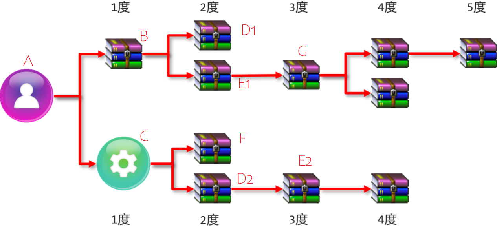

**说明:**A代表自己的项目；B,C,D,E,F,G代表的是项目所依赖的jar包；D1和D2 E1和E2代表是相同jar包的不同版本

(1) A依赖了B和C,B和C有分别依赖了其他jar包，所以在A项目中就可以使用上面所有jar包，这就是所说的依赖传递

(2) 依赖传递有直接依赖和间接依赖

* 相对于A来说，A直接依赖B和C,间接依赖了D1,E1,G，F,D2和E2
* 相对于B来说，B直接依赖了D1和E1,间接依赖了G
* 直接依赖和间接依赖是一个相对的概念

(3)因为有依赖传递的存在，就会导致jar包在依赖的过程中出现冲突问题，具体什么是冲突?Maven是如何解决冲突的?

这里所说的==依赖冲突==是指项目依赖的某一个jar包，有多个不同的版本，因而造成类包版本冲突。

情况一: 在`maven_02_ssm`的pom.xml中添加两个不同版本的Junit依赖:

```xml
<dependencies>
    <dependency>
      <groupId>junit</groupId>
      <artifactId>junit</artifactId>
      <version>4.12</version>
      <scope>test</scope>
    </dependency>

    <dependency>
      <groupId>junit</groupId>
      <artifactId>junit</artifactId>
      <version>4.11</version>
      <scope>test</scope>
    </dependency>
</dependencies>
```

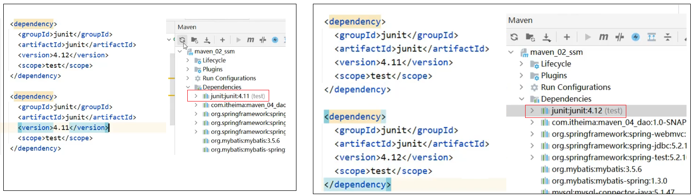

通过对比，会发现一个结论

* 特殊优先：当同级配置了相同资源的不同版本，后配置的覆盖先配置的。

情况二: 路径优先：当依赖中出现相同的资源时，层级越深，优先级越低，层级越浅，优先级越高

* A通过B间接依赖到E1
* A通过C间接依赖到E2
* A就会间接依赖到E1和E2,Maven会按照层级来选择，E1是2度，E2是3度，所以最终会选择E1

情况三: 声明优先：当资源在相同层级被依赖时，配置顺序靠前的覆盖配置顺序靠后的

* A通过B间接依赖到D1
* A通过C间接依赖到D2
* D1和D2都是两度，这个时候就不能按照层级来选择，需要按照声明来，谁先声明用谁，也就是说B在C之前声明，这个时候使用的是D1，反之则为D2

但是对应上面这些结果，大家不需要刻意去记它。因为不管Maven怎么选，最终的结果都会在Maven的`Dependencies`面板中展示出来，展示的是哪个版本，也就是说它选择的就是哪个版本，如:

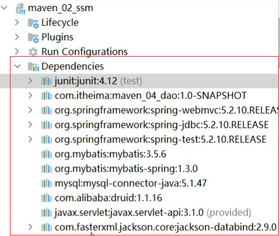

如果想更全面的查看Maven中各个坐标的依赖关系，可以点击Maven面板中的`show Dependencies`

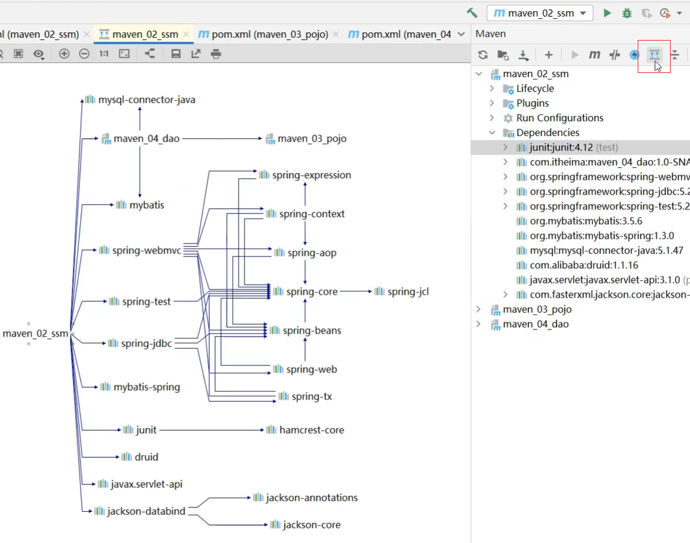

在这个视图中就能很明显的展示出jar包之间的相互依赖关系。

### 2.2 可选依赖和排除依赖

依赖传递介绍完以后，我们来思考一个问题，

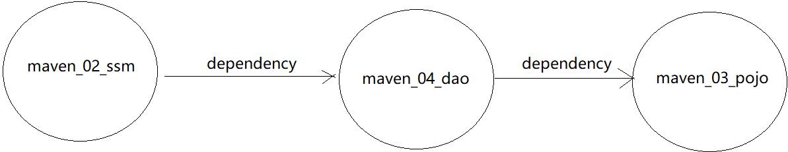

* maven_02_ssm 依赖了 maven_04_dao
* maven_04_dao 依赖了 maven_03_pojo

* 因为现在有依赖传递，所以maven_02_ssm能够使用到maven_03_pojo的内容
* 如果说现在不想让maven_02_ssm依赖到maven_03_pojo，有哪些解决方案?

**说明:**在真实使用的过程中，maven_02_ssm中是需要用到maven_03_pojo的，我们这里只是用这个例子描述我们的需求。因为有时候，maven_04_dao出于某些因素的考虑，就是不想让别人使用自己所依赖的maven_03_pojo。

#### 方案一:可选依赖

* 可选依赖指对外隐藏当前所依赖的资源---不透明

在`maven_04_dao`的pom.xml,在引入`maven_03_pojo`的时候，添加`optional`

```xml
<dependency>
    <groupId>com.itheima</groupId>
    <artifactId>maven_03_pojo</artifactId>
    <version>1.0-SNAPSHOT</version>
    <!--可选依赖是隐藏当前工程所依赖的资源，隐藏后对应资源将不具有依赖传递-->
    <optional>true</optional>
</dependency>
```

此时BookServiceImpl就已经报错了,说明由于maven_04_dao将maven_03_pojo设置成可选依赖，导致maven_02_ssm无法引用到maven_03_pojo中的内容，导致Book类找不到。

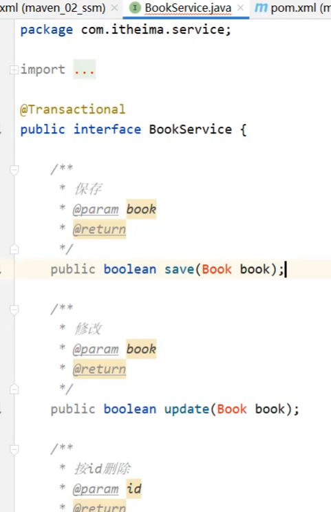

#### 方案二:排除依赖

* 排除依赖指主动断开依赖的资源，被排除的资源无需指定版本---不需要

前面我们已经通过可选依赖实现了阻断maven_03_pojo的依赖传递，对于排除依赖，则指的是已经有依赖的事实，也就是说maven_02_ssm项目中已经通过依赖传递用到了maven_03_pojo，此时我们需要做的是将其进行排除，所以接下来需要修改maven_02_ssm的pom.xml

```java
<dependency>
    <groupId>com.itheima</groupId>
    <artifactId>maven_04_dao</artifactId>
    <version>1.0-SNAPSHOT</version>
    <!--排除依赖是隐藏当前资源对应的依赖关系-->
    <exclusions>
        <exclusion>
            <groupId>com.itheima</groupId>
            <artifactId>maven_03_pojo</artifactId>
        </exclusion>
    </exclusions>
</dependency>
```

这样操作后，BookServiceImpl中的Book类一样也会报错。

当然`exclusions`标签带`s`说明我们是可以依次排除多个依赖到的jar包，比如maven_04_dao中有依赖junit和mybatis,我们也可以一并将其排除。

```xml
<dependency>
    <groupId>com.itheima</groupId>
    <artifactId>maven_04_dao</artifactId>
    <version>1.0-SNAPSHOT</version>
    <!--排除依赖是隐藏当前资源对应的依赖关系-->
    <exclusions>
        <exclusion>
            <groupId>com.itheima</groupId>
            <artifactId>maven_03_pojo</artifactId>
        </exclusion>
        <exclusion>
            <groupId>log4j</groupId>
            <artifactId>log4j</artifactId>
        </exclusion>
        <exclusion>
            <groupId>org.mybatis</groupId>
            <artifactId>mybatis</artifactId>
        </exclusion>
    </exclusions>
</dependency>
```

介绍我这两种方式后，简单来梳理下，就是

* `A依赖B,B依赖C`,`C`通过依赖传递会被`A`使用到，现在要想办法让`A`不去依赖`C`
* 可选依赖是在B上设置`<optional>`,`A`不知道有`C`的存在，
* 排除依赖是在A上设置`<exclusions>`,`A`知道有`C`的存在，主动将其排除掉。

也就是说排除依赖总共有两种方法

可选依赖,是主动的,自己想要选择 ==不要让别人看见== 的依赖,排除依赖是被动的 ==删除自己不需要的依赖==

## 3，聚合和继承

我们的项目已经从以前的单模块，变成了现在的多模块开发。项目一旦变成了多模块开发以后，就会引发一些问题，在这一节中我们主要会学习两个内容`聚合`和`继承`，用这两个知识来解决下分模块后的一些问题。

### 3.1 聚合

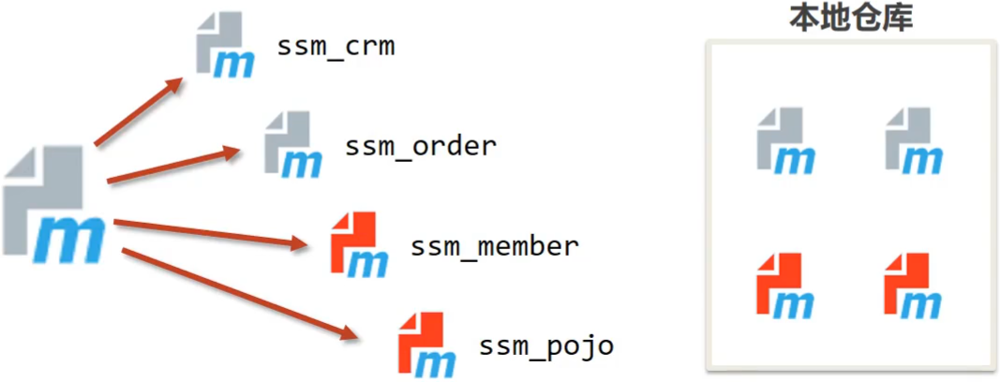

* 分模块开发后，需要将这四个项目都安装到本地仓库，目前我们只能通过项目Maven面板的`install`来安装，并且需要安装四个，如果我们的项目足够多，那么一个个安装起来还是比较麻烦的
* 如果四个项目都已经安装成功，当ssm_pojo发生变化后，我们就得将ssm_pojo重新安装到maven仓库，但是为了确保我们对ssm_pojo的修改不会影响到其他项目模块，我们需要对所有的模块进行重新编译，那又需要将所有的模块再来一遍

这就用到了我们接下来要讲解的==聚合==，

* 所谓聚合:将多个模块组织成一个整体，同时进行项目构建的过程称为聚合

* 聚合工程：通常是一个不具有业务功能的"空"工程（有且仅有一个pom文件）

* 作用：使用聚合工程可以将多个工程编组，通过对聚合工程进行构建，实现对所包含的模块进行同步构建

  * 当工程中某个模块发生更新（变更）时，必须保障工程中与已更新模块关联的模块同步更新，此时可以使用聚合工程来解决批量模块同步构建的问题。

  关于聚合具体的实现步骤为:

  #### 步骤1:创建一个空的maven项目

  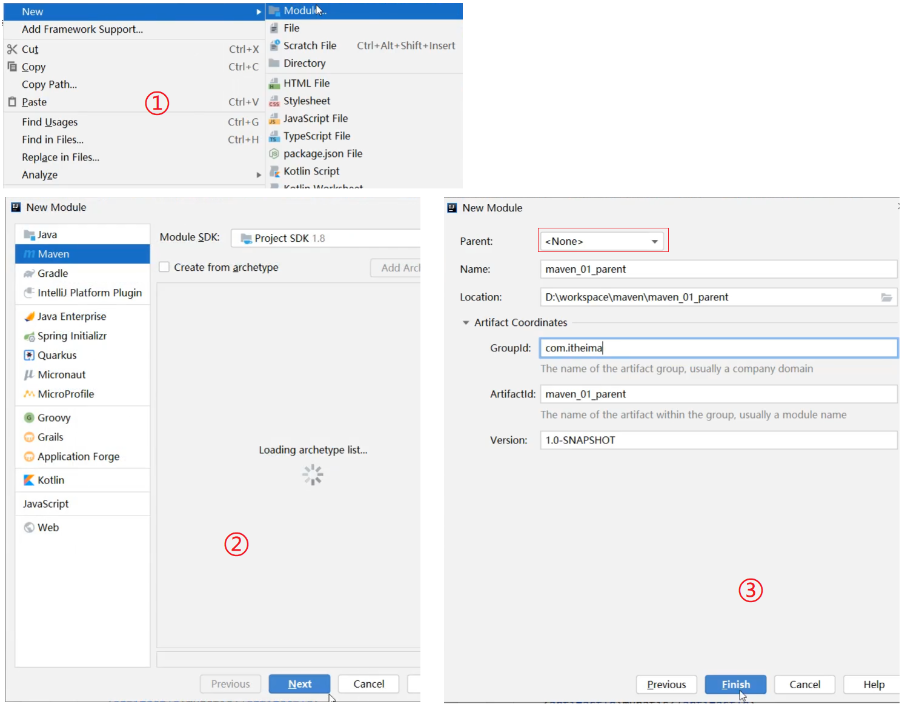

  #### 步骤2:将项目的打包方式改为pom

  ```xml
  <?xml version="1.0" encoding="UTF-8"?>
  <project xmlns="http://maven.apache.org/POM/4.0.0"
           xmlns:xsi="http://www.w3.org/2001/XMLSchema-instance"
           xsi:schemaLocation="http://maven.apache.org/POM/4.0.0 http://maven.apache.org/xsd/maven-4.0.0.xsd">
      <modelVersion>4.0.0</modelVersion>
  
      <groupId>com.itheima</groupId>
      <artifactId>maven_01_parent</artifactId>
      <version>1.0-RELEASE</version>
      <packaging>pom</packaging>
      
  </project>
  ```

  **说明:**项目的打包方式，我们接触到的有三种，分别是

  * jar:默认情况，说明该项目为java项目
  * war:说明该项目为web项目
  * pom:说明该项目为聚合或继承(后面会讲)项目

#### 步骤3:pom.xml添加所要管理的项目

```xml
<?xml version="1.0" encoding="UTF-8"?>
<project xmlns="http://maven.apache.org/POM/4.0.0"
         xmlns:xsi="http://www.w3.org/2001/XMLSchema-instance"
         xsi:schemaLocation="http://maven.apache.org/POM/4.0.0 http://maven.apache.org/xsd/maven-4.0.0.xsd">
    <modelVersion>4.0.0</modelVersion>

    <groupId>com.itheima</groupId>
    <artifactId>maven_01_parent</artifactId>
    <version>1.0-RELEASE</version>
    <packaging>pom</packaging>
    
    <!--设置管理的模块名称-->
    <modules>
        <module>../maven_02_ssm</module>
        <module>../maven_03_pojo</module>
        <module>../maven_04_dao</module>
    </modules>
</project>
```

#### 步骤4:使用聚合统一管理项目

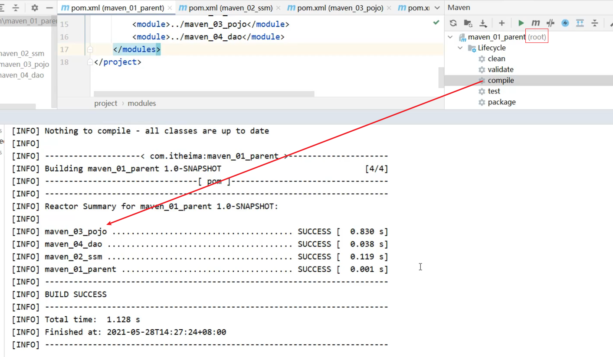

测试发现，当`maven_01_parent`的`compile`被点击后，所有被其管理的项目都会被执行编译操作。这就是聚合工程的作用。

**说明：**聚合工程管理的项目在进行运行的时候，会按照项目与项目之间的依赖关系来自动决定执行的顺序和配置的顺序无关。

聚合的知识我们就讲解完了，最后总结一句话就是，**聚合工程主要是用来管理项目**。

### 3.2 继承

我们已经完成了使用聚合工程去管理项目，聚合工程进行某一个构建操作，其他被其管理的项目也会执行相同的构建操作。那么接下来，我们再来分析下，多模块开发存在的另外一个问题，`重复配置`的问题，我们先来看张图:


* `spring-webmvc`、`spring-jdbc`在三个项目模块中都有出现，这样就出现了重复的内容
* `spring-test`只在ssm_crm和ssm_goods中出现，而在ssm_order中没有，这里是部分重复的内容
* 我们使用的spring版本目前是`5.2.10.RELEASE`,假如后期要想升级spring版本，所有跟Spring相关jar包都得被修改，涉及到的项目越多，维护成本越高

面对上面的这些问题，我们就得用到接下来要学习的==继承==

* 所谓继承:描述的是两个工程间的关系，与java中的继承相似，子工程可以继承父工程中的配置信息，常见于依赖关系的继承。

- 作用：
  - 简化配置
  - 减少版本冲突

接下来，我们到程序中去看看继承该如何实现?

#### 步骤1:创建一个空的Maven项目并将其打包方式设置为pom

因为这一步和前面maven创建聚合工程的方式是一摸一样，所以我们可以单独创建一个新的工程，也可以直接和聚合公用一个工程。实际开发中，聚合和继承一般也都放在同一个项目中，但是这两个的功能是不一样的。

#### 步骤2:在子项目中设置其父工程

分别在`maven_02_ssm`,`maven_03_pojo`,`maven_04_dao`的pom.xml中添加其父项目为`maven_01_parent` 

```java
<!--配置当前工程继承自parent工程-->
<parent>
    <groupId>com.itheima</groupId>
    <artifactId>maven_01_parent</artifactId>
    <version>1.0-RELEASE</version>
    <!--设置父项目pom.xml位置路径-->
    <relativePath>../maven_01_parent/pom.xml</relativePath>
</parent>
```

#### 步骤3:优化子项目共有依赖导入问题

1. 将子项目共同使用的jar包都抽取出来，维护在父项目的pom.xml中

```xml
<?xml version="1.0" encoding="UTF-8"?>
<project xmlns="http://maven.apache.org/POM/4.0.0"
         xmlns:xsi="http://www.w3.org/2001/XMLSchema-instance"
         xsi:schemaLocation="http://maven.apache.org/POM/4.0.0 http://maven.apache.org/xsd/maven-4.0.0.xsd">
    <modelVersion>4.0.0</modelVersion>

    <groupId>com.itheima</groupId>
    <artifactId>maven_01_parent</artifactId>
    <version>1.0-RELEASE</version>
    <packaging>pom</packaging>
    
    <!--设置管理的模块名称-->
    <modules>
        <module>../maven_02_ssm</module>
        <module>../maven_03_pojo</module>
        <module>../maven_04_dao</module>
    </modules>
    <dependencies>
        <dependency>
            <groupId>org.springframework</groupId>
            <artifactId>spring-core</artifactId>
            <version>5.2.10.RELEASE</version>
        </dependency>

        <dependency>
            <groupId>org.springframework</groupId>
            <artifactId>spring-webmvc</artifactId>
            <version>5.2.10.RELEASE</version>
        </dependency>

        <dependency>
            <groupId>org.springframework</groupId>
            <artifactId>spring-jdbc</artifactId>
            <version>5.2.10.RELEASE</version>
        </dependency>

        <dependency>
            <groupId>org.springframework</groupId>
            <artifactId>spring-test</artifactId>
            <version>5.2.10.RELEASE</version>
        </dependency>

        <dependency>
            <groupId>org.mybatis</groupId>
            <artifactId>mybatis</artifactId>
            <version>3.5.6</version>
        </dependency>

        <dependency>
            <groupId>org.mybatis</groupId>
            <artifactId>mybatis-spring</artifactId>
            <version>1.3.0</version>
        </dependency>

        <dependency>
            <groupId>mysql</groupId>
            <artifactId>mysql-connector-java</artifactId>
            <version>5.1.47</version>
        </dependency>

        <dependency>
            <groupId>com.alibaba</groupId>
            <artifactId>druid</artifactId>
            <version>1.1.16</version>
        </dependency>

        <dependency>
            <groupId>javax.servlet</groupId>
            <artifactId>javax.servlet-api</artifactId>
            <version>3.1.0</version>
            <scope>provided</scope>
        </dependency>

        <dependency>
            <groupId>com.fasterxml.jackson.core</groupId>
            <artifactId>jackson-databind</artifactId>
            <version>2.9.0</version>
        </dependency>
    </dependencies>
</project>
```

2. 删除子项目中已经被抽取到父项目的pom.xml中的jar包，如在`maven_02_ssm`的pom.xml中将已经出现在父项目的jar包删除掉

```xml
<?xml version="1.0" encoding="UTF-8"?>

<project xmlns="http://maven.apache.org/POM/4.0.0" xmlns:xsi="http://www.w3.org/2001/XMLSchema-instance"
  xsi:schemaLocation="http://maven.apache.org/POM/4.0.0 http://maven.apache.org/xsd/maven-4.0.0.xsd">
  <modelVersion>4.0.0</modelVersion>

  <groupId>com.itheima</groupId>
  <artifactId>maven_02_ssm</artifactId>
  <version>1.0-SNAPSHOT</version>
  <packaging>war</packaging>

  <!--配置当前工程继承自parent工程-->
  <parent>
    <groupId>com.itheima</groupId>
    <artifactId>maven_01_parent</artifactId>
    <version>1.0-RELEASE</version>
    <relativePath>../maven_01_parent/pom.xml</relativePath>
  </parent>
  <dependencies>
    <dependency>
      <groupId>junit</groupId>
      <artifactId>junit</artifactId>
      <version>4.12</version>
      <scope>test</scope>
    </dependency>

    <dependency>
      <groupId>junit</groupId>
      <artifactId>junit</artifactId>
      <version>4.11</version>
      <scope>test</scope>
    </dependency>

    <dependency>
      <groupId>com.itheima</groupId>
      <artifactId>maven_04_dao</artifactId>
      <version>1.0-SNAPSHOT</version>
      <!--排除依赖是隐藏当前资源对应的依赖关系-->
      <exclusions>
        <exclusion>
          <groupId>log4j</groupId>
          <artifactId>log4j</artifactId>
        </exclusion>
        <exclusion>
          <groupId>org.mybatis</groupId>
          <artifactId>mybatis</artifactId>
        </exclusion>
      </exclusions>
    </dependency>

  </dependencies>

  <build>
    <plugins>
      <plugin>
        <groupId>org.apache.tomcat.maven</groupId>
        <artifactId>tomcat7-maven-plugin</artifactId>
        <version>2.1</version>
        <configuration>
          <port>80</port>
          <path>/</path>
        </configuration>
      </plugin>
    </plugins>
  </build>
</project>


```

删除完后，你会发现父项目中有依赖对应的jar包，子项目虽然已经将重复的依赖删除掉了，但是刷新的时候，子项目中所需要的jar包依然存在。

当项目的`<parent>`标签被移除掉，会发现多出来的jar包依赖也会随之消失。

3. 将`maven_04_dao`项目的pom.xml中的所有依赖删除，然后添加上`maven_01_parent`的父项目坐标

```xml
<?xml version="1.0" encoding="UTF-8"?>
<project xmlns="http://maven.apache.org/POM/4.0.0"
         xmlns:xsi="http://www.w3.org/2001/XMLSchema-instance"
         xsi:schemaLocation="http://maven.apache.org/POM/4.0.0 http://maven.apache.org/xsd/maven-4.0.0.xsd">
    <modelVersion>4.0.0</modelVersion>

    <groupId>com.itheima</groupId>
    <artifactId>maven_04_dao</artifactId>
    <version>1.0-SNAPSHOT</version>

    <!--配置当前工程继承自parent工程-->
    <parent>
        <groupId>com.itheima</groupId>
        <artifactId>maven_01_parent</artifactId>
        <version>1.0-RELEASE</version>
        <relativePath>../maven_01_parent/pom.xml</relativePath>
    </parent>
</project>
```

刷新并查看Maven的面板，会发现maven_04_dao同样引入了父项目中的所有依赖。

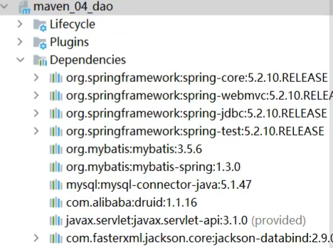

这样我们就可以解决刚才提到的第一个问题，将子项目中的公共jar包抽取到父工程中进行统一添加依赖，这样做的可以简化配置，并且当父工程中所依赖的jar包版本发生变化，所有子项目中对应的jar包版本也会跟着更新。

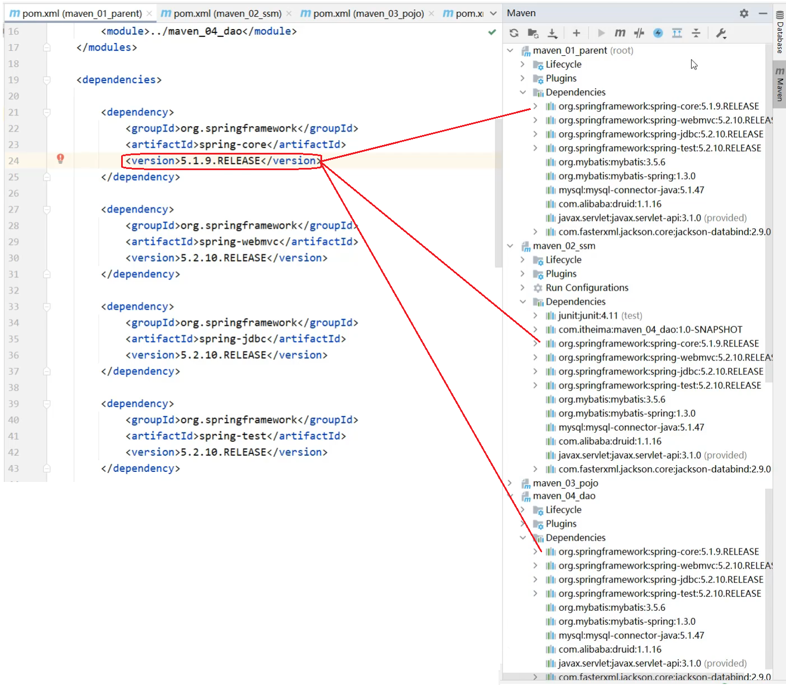

#### 步骤4:优化子项目依赖版本问题

如果把所有用到的jar包都管理在父项目的pom.xml，看上去更简单些，但是这样就会导致有很多项目引入了过多自己不需要的jar包。如上面看到的这张图:

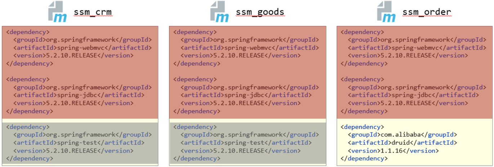

如果把所有的依赖都放在了父工程中进行统一维护，就会导致ssm_order项目中多引入了`spring-test`的jar包，如果这样的jar包过多的话，对于ssm_order来说也是一种"负担"。

那针对于这种部分项目有的jar包，我们该如何管理优化呢?

1. 在父工程mavne_01_parent的pom.xml来定义依赖管理

```xml
<!--定义依赖管理-->
<dependencyManagement>
    <dependencies>
        <dependency>
            <groupId>junit</groupId>
            <artifactId>junit</artifactId>
            <version>4.12</version>
            <scope>test</scope>
        </dependency>
    </dependencies>
</dependencyManagement>
```

2. 将maven_02_ssm的pom.xml中的junit依赖删除掉，刷新Maven

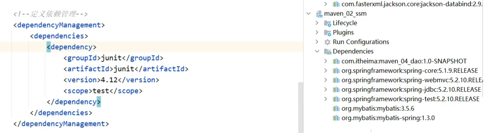

刷新完会发现，在maven_02_ssm项目中的junit依赖并没有出现，所以我们得到一个结论:

==`<dependencyManagement>`标签不真正引入jar包，而是配置可供子项目选择的jar包依赖==

子项目要想使用它所提供的这些jar包，需要自己添加依赖，并且不需要指定`<version>`

3. 在maven_02_ssm的pom.xml添加junit的依赖

```xml
<dependency>
    <groupId>junit</groupId>
    <artifactId>junit</artifactId>
    <scope>test</scope>
</dependency>
```

**注意：这里就不需要添加版本了，这样做的好处就是当父工程dependencyManagement标签中的版本发生变化后，子项目中的依赖版本也会跟着发生变化**

4. 在maven_04_dao的pom.xml添加junit的依赖

```xml
<dependency>
    <groupId>junit</groupId>
    <artifactId>junit</artifactId>
    <scope>test</scope>
</dependency>
```

这个时候，maven_02_ssm和maven_04_dao这两个项目中的junit版本就会跟随着父项目中的标签dependencyManagement中junit的版本发生变化而变化。不需要junit的项目就不需要添加对应的依赖即可。

至此继承就已经学习完了，总结来说，继承可以帮助做两件事

* 将所有项目公共的jar包依赖提取到父工程的pom.xml中，子项目就可以不用重复编写，简化开发
* 将所有项目的jar包配置到父工程的dependencyManagement标签下，实现版本管理，方便维护
  * ==dependencyManagement标签不真正引入jar包，只是管理jar包的版本==
  * 子项目在引入的时候，只需要指定groupId和artifactId，不需要加version
  * 当dependencyManagement标签中jar包版本发生变化，所有子项目中有用到该jar包的地方对应的版本会自动随之更新

最后总结一句话就是，**父工程主要是用来快速配置依赖jar包和管理项目中所使用的资源**。

**小结**

继承的实现步骤:

* 创建Maven模块，设置打包类型为pom

  ```xml
  <packaging>pom</packaging>
  ```

* 在父工程的pom文件中配置依赖关系(子工程将沿用父工程中的依赖关系),一般只抽取子项目中公有的jar包

  ```xml
  <dependencies>
      <dependency>
          <groupId>org.springframework</groupId>
          <artifactId>spring-webmvc</artifactId>
          <version>5.2.10.RELEASE</version>
      </dependency>
      ...
  </dependencies>
  ```

* 在父工程中配置子工程中可选的依赖关系

  ```xml
  <dependencyManagement>
      <dependencies>
          <dependency>
              <groupId>com.alibaba</groupId>
              <artifactId>druid</artifactId>
              <version>1.1.16</version>
          </dependency>
      </dependencies>
      ...
  </dependencyManagement>
  ```

* 在子工程中配置当前工程所继承的父工程

  ```xml
  <!--定义该工程的父工程-->
  <parent>
      <groupId>com.itheima</groupId>
      <artifactId>maven_01_parent</artifactId>
      <version>1.0-RELEASE</version>
      <!--填写父工程的pom文件,可以不写-->
      <relativePath>../maven_01_parent/pom.xml</relativePath>
  </parent>
  ```

* 在子工程中配置使用父工程中可选依赖的坐标

  ```xml
  <dependencies>
      <dependency>
          <groupId>com.alibaba</groupId>
          <artifactId>druid</artifactId>
      </dependency>
  </dependencies>
  ```

  注意事项:

  1.子工程中使用父工程中的可选依赖时，仅需要提供群组id和项目id，无需提供版本，版本由父工程统一提供，避免版本冲突

  2.子工程中还可以定义父工程中没有定义的依赖关系,只不过不能被父工程进行版本统一管理。

### 3.3 聚合与继承的区别

#### 3.3.1 聚合与继承的区别

两种之间的作用:

* 聚合用于快速构建项目，对项目进行管理
* 继承用于快速配置和管理子项目中所使用jar包的版本

聚合和继承的相同点:

* 聚合与继承的pom.xml文件打包方式均为pom，可以将两种关系制作到同一个pom文件中
* 聚合与继承均属于设计型模块，并无实际的模块内容

聚合和继承的不同点:

* 聚合是在当前模块中配置关系，聚合可以感知到参与聚合的模块有哪些
* 继承是在子模块中配置关系，父模块无法感知哪些子模块继承了自己

相信到这里，大家已经能区分开什么是聚合和继承，但是有一个稍微麻烦的地方就是聚合和继承的工程构建，需要在聚合项目中手动添加`modules`标签，需要在所有的子项目中添加`parent`标签，万一写错了咋办?

#### 3.3.2 IDEA构建聚合与继承工程

其实对于聚合和继承工程的创建，IDEA已经能帮助我们快速构建，具体的实现步骤为:

##### 步骤1:创建一个Maven项目

创建一个空的Maven项目，可以将项目中的`src`目录删除掉，这个项目作为聚合工程和父工程。

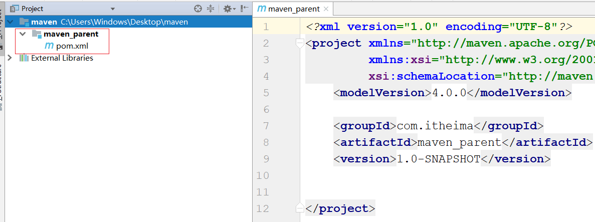

##### 步骤2:创建子项目

该项目可以被聚合工程管理，同时会继承父工程。


创建成功后，maven_parent即是聚合工程又是父工程，maven_web中也有parent标签，继承的就是maven_parent,对于难以配置的内容都自动生成。

按照上面这种方式，大家就可以根据自己的需要来构建分模块项目。