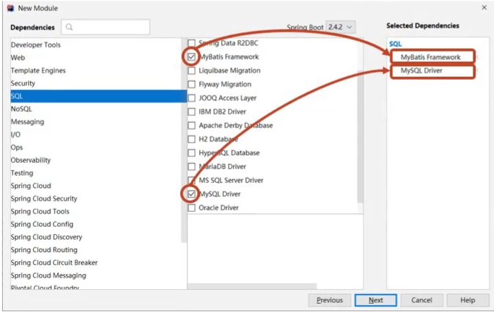
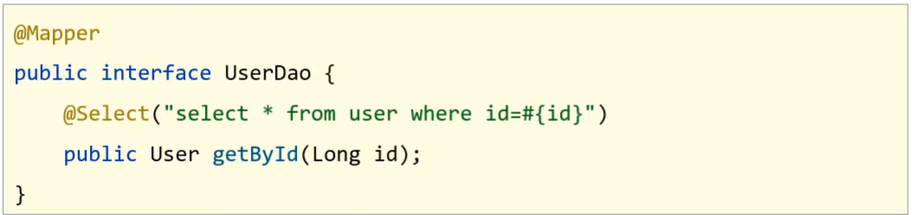
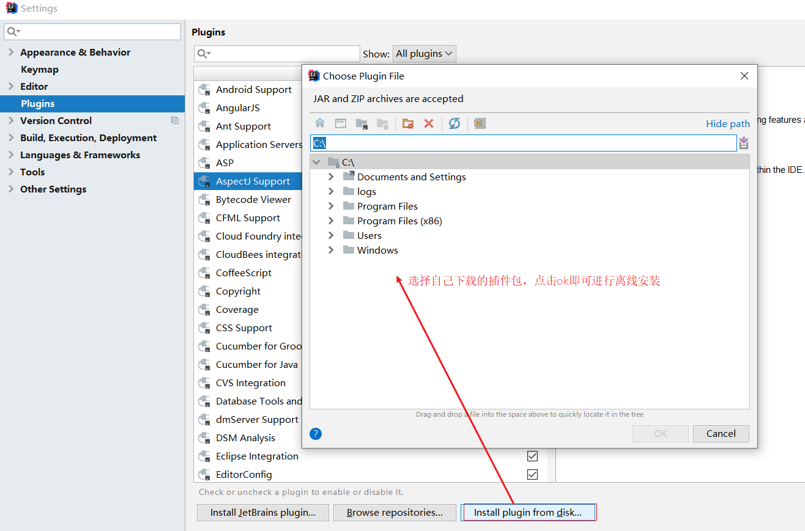
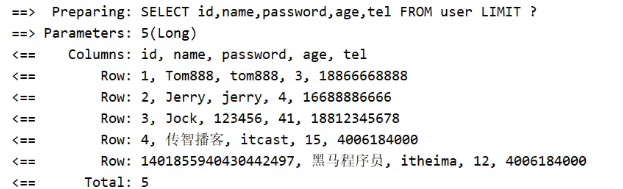
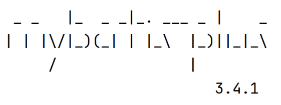
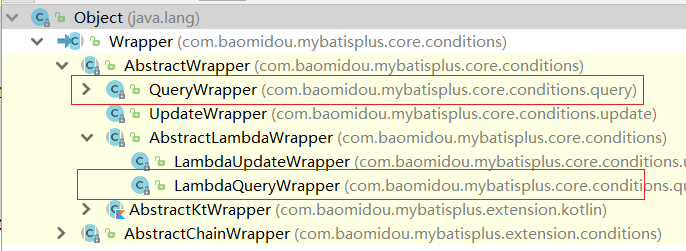

## MyBatisPlus

**今日目标**

> 基于MyBatisPlus完成标准Dao的增删改查功能
>
> 掌握MyBatisPlus中的分页及条件查询构建
>
> 掌握主键ID的生成策略
>
> 了解MyBatisPlus的代码生成器

## 1，MyBatisPlus入门案例与简介

这一节我们来学习下MyBatisPlus的入门案例与简介，这个和其他课程都不太一样，其他的课程都是先介绍概念，然后再写入门案例。而对于MyBatisPlus的学习，我们将顺序做了调整，主要的原因MyBatisPlus主要是对MyBatis的简化，所有我们先体会下它简化在哪，然后再学习它是什么，以及它帮我们都做哪些事。

### 1.1 入门案例

* MybatisPlus(简称MP)是基于MyBatis框架基础上开发的增强型工具，旨在简化开发、提供效率。

开发方式

* 基于MyBatis使用MyBatisPlus
* 基于Spring使用MyBatisPlus
* ==基于SpringBoot使用MyBatisPlus==

SpringBoot刚刚我们学习完成，它能快速构建Spring开发环境用以整合其他技术，使用起来是非常简单，对于MP的学习，我们也基于SpringBoot来构建学习。

学习之前，我们先来回顾下，SpringBoot整合Mybatis的开发过程:

* 创建SpringBoot工程

  

* 勾选配置使用的技术，能够实现自动添加起步依赖包

  

* 设置dataSource相关属性(JDBC参数)

  

* 定义数据层接口映射配置

  

我们可以参考着上面的这个实现步骤把SpringBoot整合MyBatisPlus来快速实现下，具体的实现步骤为:

#### 步骤1:创建数据库及表

```sql
create database if not exists mybatisplus_db character set utf8;
use mybatisplus_db;
CREATE TABLE user (
    id bigint(20) primary key auto_increment,
    name varchar(32) not null,
    password  varchar(32) not null,
    age int(3) not null ,
    tel varchar(32) not null
);
insert into user values(1,'Tom','tom',3,'18866668888');
insert into user values(2,'Jerry','jerry',4,'16688886666');
insert into user values(3,'Jock','123456',41,'18812345678');
insert into user values(4,'传智播客','itcast',15,'4006184000');
```

#### 步骤2:创建SpringBoot工程


#### 步骤3:勾选配置使用技术


**说明:**

* 由于MP并未被收录到idea的系统内置配置，无法直接选择加入，需要手动在pom.xml中配置添加

#### 步骤4:pom.xml补全依赖

```xml
<dependency>
    <groupId>com.baomidou</groupId>
    <artifactId>mybatis-plus-boot-starter</artifactId>
    <version>3.4.1</version>
</dependency>
<dependency>
    <groupId>com.alibaba</groupId>
    <artifactId>druid</artifactId>
    <version>1.1.16</version>
</dependency>
```

**说明:**

* druid数据源可以加也可以不加，SpringBoot有内置的数据源，可以配置成使用Druid数据源

* 从MP的依赖关系可以看出，通过依赖传递已经将MyBatis与MyBatis整合Spring的jar包导入，我们不需要额外在添加MyBatis的相关jar包

  

#### 步骤5:添加MP的相关配置信息

resources默认生成的是properties配置文件，可以将其替换成yml文件，并在文件中配置数据库连接的相关信息:`application.yml`

```yml
spring:
  datasource:
    type: com.alibaba.druid.pool.DruidDataSource
    driver-class-name: com.mysql.cj.jdbc.Driver
    url: jdbc:mysql://localhost:3306/mybatisplus_db?serverTimezone=UTC 
    username: root
    password: root
```

**说明:**==serverTimezone是用来设置时区，UTC是标准时区，和咱们的时间差8小时，所以可以将其修改为`Asia/Shanghai`==

#### 步骤6:根据数据库表创建实体类

```java
public class User {   
    private Long id;
    private String name;
    private String password;
    private Integer age;
    private String tel;
    //setter...getter...toString方法略
}
```

#### 步骤7:创建Dao接口

```java
@Mapper
public interface UserDao extends BaseMapper<User>{
}
```

#### 步骤8:编写引导类

```java
@SpringBootApplication
//@MapperScan("com.itheima.dao")
public class Mybatisplus01QuickstartApplication {
    public static void main(String[] args) {
        SpringApplication.run(Mybatisplus01QuickstartApplication.class, args);
    }

}
```

**说明:**Dao接口要想被容器扫描到，有两种解决方案:

* 方案一:在Dao接口上添加`@Mapper`注解，并且确保Dao处在引导类所在包或其子包中
  * 该方案的缺点是需要在每一Dao接口中添加注解
* 方案二:在引导类上添加`@MapperScan`注解，其属性为所要扫描的Dao所在包
  * 该方案的好处是只需要写一次，则指定包下的所有Dao接口都能被扫描到，`@Mapper`就可以不写。

#### 步骤9:编写测试类

```java
@SpringBootTest
class MpDemoApplicationTests {

	@Autowired
	private UserDao userDao;
	@Test
	public void testGetAll() {
		List<User> userList = userDao.selectList(null);
		System.out.println(userList);
	}
}
```

**说明:**

userDao注入的时候下面有红线提示的原因是什么?

* UserDao是一个接口，不能实例化对象

* 只有在服务器启动IOC容器初始化后，由框架创建DAO接口的代理对象来注入
* 现在服务器并未启动，所以代理对象也未创建，IDEA查找不到对应的对象注入，所以提示报红
* 一旦服务启动，就能注入其代理对象，所以该错误提示不影响正常运行。

查看运行结果:


跟之前整合MyBatis相比，你会发现我们不需要在DAO接口中编写方法和SQL语句了，只需要继承`BaseMapper`接口即可。整体来说简化很多。

### 1.2 MybatisPlus简介

MyBatisPlus（简称MP）是基于MyBatis框架基础上开发的增强型工具，旨在==简化开发、提高效率==

通过刚才的案例，相信大家能够体会简化开发和提高效率这两个方面的优点。

MyBatisPlus的官网为:`https://mp.baomidou.com/`

**说明:**


现在的页面中，这一行已经被删除，现在再去访问`https://mybatis.plus`会发现访问不到，这个就有很多可能性供我们猜想了，所以大家使用baomidou的网址进行访问即可。

官方文档中有一张很多小伙伴比较熟悉的图片:


从这张图中我们可以看出MP旨在成为MyBatis的最好搭档，而不是替换MyBatis,所以可以理解为MP是MyBatis的一套增强工具，它是在MyBatis的基础上进行开发的，我们虽然使用MP但是底层依然是MyBatis的东西，也就是说我们也可以在MP中写MyBatis的内容。

对于MP的学习，大家可以参考着官方文档来进行学习，里面都有详细的代码案例。

MP的特性:

- 无侵入：只做增强不做改变，不会对现有工程产生影响
- 强大的 CRUD 操作：内置通用 Mapper，少量配置即可实现单表CRUD 操作
- 支持 Lambda：编写查询条件无需担心字段写错
- 支持主键自动生成
- 内置分页插件
- ……

## 2，标准数据层开发

在这一节中我们重点学习的是数据层标准的CRUD(增删改查)的实现与分页功能。代码比较多，我们一个个来学习。

### 2.1 标准CRUD使用

对于标准的CRUD功能都有哪些以及MP都提供了哪些方法可以使用呢?

我们先来看张图:


对于这张图的方法，我们挨个来演示下:

首先说下，案例中的环境就是咱们入门案例的内容，第一个先来完成`新增`功能

### 2.2 新增

在进行新增之前，我们可以分析下新增的方法:

```java
int insert (T t)
```

* T:泛型，新增用来保存新增数据

* int:返回值，新增成功后返回1，没有新增成功返回的是0

在测试类中进行新增操作:

```java
@SpringBootTest
class Mybatisplus01QuickstartApplicationTests {

    @Autowired
    private UserDao userDao;

    @Test
    void testSave() {
        User user = new User();
        user.setName("黑马程序员");
        user.setPassword("itheima");
        user.setAge(12);
        user.setTel("4006184000");
        userDao.insert(user);
    }
}
```

执行测试后，数据库表中就会添加一条数据。


但是数据中的主键ID，有点长，那这个主键ID是如何来的?我们更想要的是主键自增，应该是5才对，这个是我们后面要学习的主键ID生成策略，这块的这个问题，我们暂时先放放。

### 2.3 删除

在进行删除之前，我们可以分析下删除的方法:

```java
int deleteById (Serializable id)
```

* Serializable：参数类型

  * 思考:参数类型为什么是一个序列化类?

    

    从这张图可以看出，

    * String和Number是Serializable的子类，
    * Number又是Float,Double,Integer等类的父类，
    * 能作为主键的数据类型都已经是Serializable的子类，
    * MP使用Serializable作为参数类型，就好比我们可以用Object接收任何数据类型一样。

* int:返回值类型，数据删除成功返回1，未删除数据返回0。

在测试类中进行新增操作:

```java
 @SpringBootTest
class Mybatisplus01QuickstartApplicationTests {

    @Autowired
    private UserDao userDao;

    @Test
    void testDelete() {
        userDao.deleteById(1401856123725713409L);
    }
}

```

### 2.4 修改

在进行修改之前，我们可以分析下修改的方法:

```java
int updateById(T t);
```

- T:泛型，需要修改的数据内容，注意因为是根据ID进行修改，所以传入的对象中需要有ID属性值

- int:返回值，修改成功后返回1，未修改数据返回0

在测试类中进行新增操作:

```java
@SpringBootTest
class Mybatisplus01QuickstartApplicationTests {

    @Autowired
    private UserDao userDao;

    @Test
    void testUpdate() {
        User user = new User();
        user.setId(1L);
        user.setName("Tom888");
        user.setPassword("tom888");
        userDao.updateById(user);
    }
}
```

**说明:**修改的时候，只修改实体对象中有值的字段。

### 2.5 根据ID查询

在进行根据ID查询之前，我们可以分析下根据ID查询的方法:

```java
T selectById (Serializable id)
```

- Serializable：参数类型,主键ID的值
- T:根据ID查询只会返回一条数据

在测试类中进行新增操作:

```java
@SpringBootTest
class Mybatisplus01QuickstartApplicationTests {

    @Autowired
    private UserDao userDao;
    
    @Test
    void testGetById() {
        User user = userDao.selectById(2L);
        System.out.println(user);
    }
}
```

### 2.6 查询所有

在进行查询所有之前，我们可以分析下查询所有的方法:

```java
List<T> selectList(Wrapper<T> queryWrapper)
```

- Wrapper：用来构建条件查询的条件，目前我们没有可直接传为Null
- List<T>:因为查询的是所有，所以返回的数据是一个集合

在测试类中进行新增操作:

```java
@SpringBootTest
class Mybatisplus01QuickstartApplicationTests {

    @Autowired
    private UserDao userDao;
    
    @Test
    void testGetAll() {
        List<User> userList = userDao.selectList(null);
        System.out.println(userList);
    }
}
```

我们所调用的方法都是来自于DAO接口继承的BaseMapper类中。里面的方法有很多，我们后面会慢慢去学习里面的内容。

### 2.7 Lombok

代码写到这，我们会发现DAO接口类的编写现在变成最简单的了，里面什么都不用写。反过来看看模型类的编写都需要哪些内容:

* 私有属性
* setter...getter...方法
* toString方法
* 构造函数

虽然这些内容不难，同时也都是通过IDEA工具生成的，但是过程还是必须得走一遍，那么对于模型类的编写有没有什么优化方法?就是我们接下来要学习的Lombok。

#### 概念

* Lombok，一个Java类库，提供了一组注解，简化POJO实体类开发。

#### 使用步骤

##### 步骤1:添加lombok依赖

```xml
<dependency>
    <groupId>org.projectlombok</groupId>
    <artifactId>lombok</artifactId>
    <!--<version>1.18.12</version>-->
</dependency>
```

**注意：**版本可以不用写，因为SpringBoot中已经管理了lombok的版本。

##### 步骤2:安装Lombok的插件

==新版本IDEA已经内置了该插件，如果删除setter和getter方法程序有报红，则需要安装插件==


如果在IDEA中找不到lombok插件，可以访问如下网站

`https://plugins.jetbrains.com/plugin/6317-lombok/versions`

根据自己IDEA的版本下载对应的lombok插件，下载成功后，在IDEA中采用离线安装的方式进行安装。



##### 步骤3:模型类上添加注解

Lombok常见的注解有:

* @Setter:为模型类的属性提供setter方法
* @Getter:为模型类的属性提供getter方法
* @ToString:为模型类的属性提供toString方法
* @EqualsAndHashCode:为模型类的属性提供equals和hashcode方法
* ==@Data:是个组合注解，包含上面的注解的功能==
* ==@NoArgsConstructor:提供一个无参构造函数==
* ==@AllArgsConstructor:提供一个包含所有参数的构造函数==

Lombok的注解还有很多，上面标红的三个是比较常用的，其他的大家后期用到了，再去补充学习。

```java
@Data
@AllArgsConstructor
@NoArgsConstructor
public class User {
    private Long id;
    private String name;
    private String password;
    private Integer age;
    private String tel;
}
```

**说明:**

Lombok只是简化模型类的编写，我们之前的方法也能用，比如有人会问:我如果只想要有name和password的构造函数，该如何编写?

```java
@Data
@AllArgsConstructor
@NoArgsConstructor
public class User {
    private Long id;
    private String name;
    private String password;
    private Integer age;
    private String tel;

    public User(String name, String password) {
        this.name = name;
        this.password = password;
    }
}
```

这种方式是被允许的。

### 2.8 分页功能

基础的增删改查就已经学习完了，刚才我们在分析基础开发的时候，有一个分页功能还没有实现，在MP中如何实现分页功能，就是咱们接下来要学习的内容。

分页查询使用的方法是:

```java
IPage<T> selectPage(IPage<T> page, Wrapper<T> queryWrapper)
```

- IPage:用来构建分页查询条件
- Wrapper：用来构建条件查询的条件，目前我们没有可直接传为Null

- IPage:返回值，你会发现构建分页条件和方法的返回值都是IPage

IPage是一个接口，我们需要找到它的实现类来构建它，具体的实现类，可以进入到IPage类中按ctrl+h,会找到其有一个实现类为`Page`。

#### 步骤1:调用方法传入参数获取返回值

```java
@SpringBootTest
class Mybatisplus01QuickstartApplicationTests {

    @Autowired
    private UserDao userDao;
    
    //分页查询
    @Test
    void testSelectPage(){
        //1 创建IPage分页对象,设置分页参数,1为当前页码，3为每页显示的记录数
        IPage<User> page=new Page<>(1,3);
        //2 执行分页查询
        userDao.selectPage(page,null);
        //3 获取分页结果
        System.out.println("当前页码值："+page.getCurrent());
        System.out.println("每页显示数："+page.getSize());
        System.out.println("一共多少页："+page.getPages());
        System.out.println("一共多少条数据："+page.getTotal());
        System.out.println("数据："+page.getRecords());
    }
}
```

#### 步骤2:设置分页拦截器

这个拦截器MP已经为我们提供好了，我们只需要将其配置成Spring管理的bean对象即可。

```java
@Configuration
public class MybatisPlusConfig {
    
    @Bean
    public MybatisPlusInterceptor mybatisPlusInterceptor(){
        //1 创建MybatisPlusInterceptor拦截器对象
        MybatisPlusInterceptor mpInterceptor=new MybatisPlusInterceptor();
        //2 添加分页拦截器
        mpInterceptor.addInnerInterceptor(new PaginationInnerInterceptor());
        return mpInterceptor;
    }
}
```

**说明:**上面的代码记不住咋办呢?

这些内容在MP的官方文档中有详细的说明，我们可以查看官方文档类配置


#### 步骤3:运行测试程序

如果想查看MP执行的SQL语句，可以修改application.yml配置文件，

```yml
mybatis-plus:
  configuration:
    log-impl: org.apache.ibatis.logging.stdout.StdOutImpl #打印SQL日志到控制台
```

打开日志后，就可以在控制台打印出对应的SQL语句，开启日志功能性能就会受到影响，调试完后记得关闭。



(Mybatis的分页查询,本身是一个增强,因此需要在Dao加拦截器)


## 3，DQL编程控制

增删改查四个操作中，查询是非常重要的也是非常复杂的操作，这块需要我们重点学习下，这节我们主要学习的内容有:

* 条件查询方式
* 查询投影
* 查询条件设定
* 字段映射与表名映射

### 3.1 条件查询

#### 3.1.1 条件查询的类

* MyBatisPlus将书写复杂的SQL查询条件进行了封装，使用编程的形式完成查询条件的组合。

这个我们在前面都有见过，比如查询所有和分页查询的时候，都有看到过一个`Wrapper`类，这个类就是用来构建查询条件的，如下图所示:


那么条件查询如何使用Wrapper来构建呢?

#### 3.1.2 环境构建

在构建条件查询之前，我们先来准备下环境

* 创建一个SpringBoot项目

* pom.xml中添加对应的依赖

```java
<?xml version="1.0" encoding="UTF-8"?>
<project xmlns="http://maven.apache.org/POM/4.0.0" xmlns:xsi="http://www.w3.org/2001/XMLSchema-instance"
         xsi:schemaLocation="http://maven.apache.org/POM/4.0.0 https://maven.apache.org/xsd/maven-4.0.0.xsd">
    <modelVersion>4.0.0</modelVersion>
    <parent>
        <groupId>org.springframework.boot</groupId>
        <artifactId>spring-boot-starter-parent</artifactId>
        <version>2.5.0</version>
    </parent>
    <groupId>com.itheima</groupId>
    <artifactId>mybatisplus_02_dql</artifactId>
    <version>0.0.1-SNAPSHOT</version>
    <properties>
        <java.version>1.8</java.version>
    </properties>
    <dependencies>

        <dependency>
            <groupId>com.baomidou</groupId>
            <artifactId>mybatis-plus-boot-starter</artifactId>
            <version>3.4.1</version>
        </dependency>

        <dependency>
            <groupId>org.springframework.boot</groupId>
            <artifactId>spring-boot-starter</artifactId>
        </dependency>

        <dependency>
            <groupId>com.alibaba</groupId>
            <artifactId>druid</artifactId>
            <version>1.1.16</version>
        </dependency>

        <dependency>
            <groupId>mysql</groupId>
            <artifactId>mysql-connector-java</artifactId>
            <scope>runtime</scope>
        </dependency>

        <dependency>
            <groupId>org.springframework.boot</groupId>
            <artifactId>spring-boot-starter-test</artifactId>
            <scope>test</scope>
        </dependency>

        <dependency>
            <groupId>org.projectlombok</groupId>
            <artifactId>lombok</artifactId>
        </dependency>

    </dependencies>

    <build>
        <plugins>
            <plugin>
                <groupId>org.springframework.boot</groupId>
                <artifactId>spring-boot-maven-plugin</artifactId>
            </plugin>
        </plugins>
    </build>

</project>

```

编写UserDao接口

```java
@Mapper
public interface UserDao extends BaseMapper<User> {
}
```

编写引导类

```java
@SpringBootApplication
public class Mybatisplus02DqlApplication {

    public static void main(String[] args) {
        SpringApplication.run(Mybatisplus02DqlApplication.class, args);
    }

}
```

* 编写配置文件

  ```yml
  # dataSource
  spring:
    datasource:
      type: com.alibaba.druid.pool.DruidDataSource
      driver-class-name: com.mysql.cj.jdbc.Driver
      url: jdbc:mysql://localhost:3306/mybatisplus_db?serverTimezone=UTC
      username: root
      password: root
  # mp日志
  mybatis-plus:
    configuration:
      log-impl: org.apache.ibatis.logging.stdout.StdOutImpl
  ```

* 编写测试类

  ```java
  @SpringBootTest
  class Mybatisplus02DqlApplicationTests {
  
      @Autowired
      private UserDao userDao;
      
      @Test
      void testGetAll(){
          List<User> userList = userDao.selectList(null);
          System.out.println(userList);
      }
  }
  ```

  最终创建的项目结构为:

  

* 测试的时候，控制台打印的日志比较多，速度有点慢而且不利于查看运行结果，所以接下来我们把这个日志处理下:

  * 取消初始化spring日志打印，resources目录下添加logback.xml，名称固定，内容如下:

    ```xml
    <?xml version="1.0" encoding="UTF-8"?>
    <configuration>
    </configuration>
    ```

    **说明:**logback.xml的配置内容，不是我们学习的重点，如果有兴趣可以自行百度查询。

  * 取消MybatisPlus启动banner图标

    

    application.yml添加如下内容:


```java
# mybatis-plus日志控制台输出
mybatis-plus:
  configuration:
    log-impl: org.apache.ibatis.logging.stdout.StdOutImpl
  global-config:
    banner: off # 关闭mybatisplus启动图标
```

* * 取消SpringBoot的log打印

    

    application.yml添加如下内容:

    ```yml
    spring:
      main:
        banner-mode: off # 关闭SpringBoot启动图标(banner)
    ```

解决控制台打印日志过多的相关操作可以不用去做，一般会被用来方便我们查看程序运行的结果。

#### 3.1.3 构建条件查询

在进行查询的时候，我们的入口是在Wrapper这个类上，因为它是一个接口，所以我们需要去找它对应的实现类，关于实现类也有很多，说明我们有多种构建查询条件对象的方式，



1. 先来看第一种:==QueryWrapper==

```java
@SpringBootTest
class Mybatisplus02DqlApplicationTests {

    @Autowired
    private UserDao userDao;
    
    @Test
    void testGetAll(){
        QueryWrapper qw = new QueryWrapper();
        qw.lt("age",18);
        List<User> userList = userDao.selectList(qw);
        System.out.println(userList);
    }
}
```

* lt: 小于(<) ,最终的sql语句为

  ```sql
  SELECT id,name,password,age,tel FROM user WHERE (age < ?)
  ```

第一种方式介绍完后，有个小问题就是在写条件的时候，容易出错，比如age写错，就会导致查询不成功

2. 接着来看第二种:==QueryWrapper的基础上使用lambda==

2. 接着来看第二种:==QueryWrapper的基础上使用lambda==

```java
@SpringBootTest
class Mybatisplus02DqlApplicationTests {

    @Autowired
    private UserDao userDao;
    
    @Test
    void testGetAll(){
        QueryWrapper<User> qw = new QueryWrapper<User>();
        qw.lambda().lt(User::getAge, 10);//添加条件
        List<User> userList = userDao.selectList(qw);
        System.out.println(userList);
    }
}
```

* User::getAget,为lambda表达式中的，类名::方法名，最终的sql语句为:

```sql
SELECT id,name,password,age,tel FROM user WHERE (age < ?)
```

**注意:**构建LambdaQueryWrapper的时候泛型不能省。

此时我们再次编写条件的时候，就不会存在写错名称的情况，但是qw后面多了一层lambda()调用

3. 接着来看第三种:==LambdaQueryWrapper==

```java
@SpringBootTest
class Mybatisplus02DqlApplicationTests {

    @Autowired
    private UserDao userDao;
    
    @Test
    void testGetAll(){
        LambdaQueryWrapper<User> lqw = new LambdaQueryWrapper<User>();
        lqw.lt(User::getAge, 10);
        List<User> userList = userDao.selectList(lqw);
        System.out.println(userList);
    }
}
```

这种方式就解决了上一种方式所存在的问题。

#### 3.1.4 多条件构建

学完了三种构建查询对象的方式，每一种都有自己的特点，所以用哪一种都行，刚才都是一个条件，那如果有多个条件该如何构建呢?

> 需求:查询数据库表中，年龄在10岁到30岁之间的用户信息

#### 3.1.5 null判定

先来看一张图，


* 我们在做条件查询的时候，一般会有很多条件可以供用户进行选择查询。
* 这些条件用户可以选择使用也可以选择不使用，比如我要查询价格在8000以上的手机
* 在输入条件的时候，价格有一个区间范围，按照需求只需要在第一个价格输入框中输入8000
* 后台在做价格查询的时候，一般会让 price>值1 and price <值2
* 因为前端没有输入值2，所以如果不处理的话，就会出现 price>8000 and price < null问题

* 这个时候查询的结果就会出问题，具体该如何解决?


> 需求:查询数据库表中，根据输入年龄范围来查询符合条件的记录
>
> 用户在输入值的时候，
>
> ​	如果只输入第一个框，说明要查询大于该年龄的用户
>
> ​	如果只输入第二个框，说明要查询小于该年龄的用户
>
> ​    如果两个框都输入了，说明要查询年龄在两个范围之间的用户

思考第一个问题：后台如果想接收前端的两个数据，该如何接收?

我们可以使用两个简单数据类型，也可以使用一个模型类，但是User类中目前只有一个age属性,如:

```java
@Data
public class User {
    private Long id;
    private String name;
    private String password;
    private Integer age;
    private String tel;
}
```

使用一个age属性，如何去接收页面上的两个值呢?这个时候我们有两个解决方案

方案一:添加属性age2,这种做法可以但是会影响到原模型类的属性内容

```java
@Data
public class User {
    private Long id;
    private String name;
    private String password;
    private Integer age;
    private String tel;
    private Integer age2;
}
```

方案二:新建一个模型类,让其继承User类，并在其中添加age2属性，UserQuery在拥有User属性后同时添加了age2属性。

```java
@Data
public class User {
    private Long id;
    private String name;
    private String password;
    private Integer age;
    private String tel;
}

@Data
public class UserQuery extends User {
    private Integer age2;
}
```

方案二:新建一个模型类,让其继承User类，并在其中添加age2属性，UserQuery在拥有User属性后同时添加了age2属性。

```java
@Data
public class User {
    private Long id;
    private String name;
    private String password;
    private Integer age;
    private String tel;
}

@Data
public class UserQuery extends User {
    private Integer age2;
}
```

环境准备好后，我们来实现下刚才的需求：

```java
@SpringBootTest
class Mybatisplus02DqlApplicationTests {

    @Autowired
    private UserDao userDao;
    
    @Test
    void testGetAll(){
        //模拟页面传递过来的查询数据
        UserQuery uq = new UserQuery();
        uq.setAge(10);
        uq.setAge2(30);
        LambdaQueryWrapper<User> lqw = new LambdaQueryWrapper<User>();
        if(null != uq.getAge2()){
            lqw.lt(User::getAge, uq.getAge2());
        }
        if( null != uq.getAge()) {
            lqw.gt(User::getAge, uq.getAge());
        }
        List<User> userList = userDao.selectList(lqw);
        System.out.println(userList);
    }
}
```

上面的写法可以完成条件为非空的判断，但是问题很明显，如果条件多的话，每个条件都需要判断，代码量就比较大，来看MP给我们提供的简化方式：

```java
@SpringBootTest
class Mybatisplus02DqlApplicationTests {

    @Autowired
    private UserDao userDao;
    
    @Test
    void testGetAll(){
        //模拟页面传递过来的查询数据
        UserQuery uq = new UserQuery();
        uq.setAge(10);
        uq.setAge2(30);
        LambdaQueryWrapper<User> lqw = new LambdaQueryWrapper<User>();
        lqw.lt(null!=uq.getAge2(),User::getAge, uq.getAge2());
        lqw.gt(null!=uq.getAge(),User::getAge, uq.getAge());
        List<User> userList = userDao.selectList(lqw);
        System.out.println(userList);
    }
}
```

* lt()方法

  

  condition为boolean类型，返回true，则添加条件，返回false则不添加条件

### 3.2 查询投影

#### 3.2.1 查询指定字段

目前我们在查询数据的时候，什么都没有做默认就是查询表中所有字段的内容，我们所说的查询投影即不查询所有字段，只查询出指定内容的数据。

具体如何来实现?

```java
@SpringBootTest
class Mybatisplus02DqlApplicationTests {

    @Autowired
    private UserDao userDao;
    
    @Test
    void testGetAll(){
        LambdaQueryWrapper<User> lqw = new LambdaQueryWrapper<User>();
        lqw.select(User::getId,User::getName,User::getAge);
        List<User> userList = userDao.selectList(lqw);
        System.out.println(userList);
    }
}
```

* select(...)方法用来设置查询的字段列，可以设置多个，最终的sql语句为:

  ```sql
  SELECT id,name,age FROM user
  ```

* 如果使用的不是lambda，就需要手动指定字段

  ```java
  @SpringBootTest
  class Mybatisplus02DqlApplicationTests {
  
      @Autowired
      private UserDao userDao;
      
      @Test
      void testGetAll(){
          QueryWrapper<User> lqw = new QueryWrapper<User>();
          lqw.select("id","name","age","tel");
          List<User> userList = userDao.selectList(lqw);
          System.out.println(userList);
      }
  }
  ```

  * 最终的sql语句为:SELECT id,name,age,tel FROM user

```sql
SELECT id,name,age FROM user
```

#### 3.2.2 聚合查询

> 需求:聚合函数查询，完成count、max、min、avg、sum的使用
>
> count:总记录数
>
> max:最大值
>
> min:最小值
>
> avg:平均值
>
> sum:求和

```java
@SpringBootTest
class Mybatisplus02DqlApplicationTests {

    @Autowired
    private UserDao userDao;
    
    @Test
    void testGetAll(){
        QueryWrapper<User> lqw = new QueryWrapper<User>();
        //lqw.select("count(*) as count");
        //SELECT count(*) as count FROM user
        //lqw.select("max(age) as maxAge");
        //SELECT max(age) as maxAge FROM user
        //lqw.select("min(age) as minAge");
        //SELECT min(age) as minAge FROM user
        //lqw.select("sum(age) as sumAge");
        //SELECT sum(age) as sumAge FROM user
        lqw.select("avg(age) as avgAge");
        //SELECT avg(age) as avgAge FROM user
        List<Map<String, Object>> userList = userDao.selectMaps(lqw);
        System.out.println(userList);
    }
}
```

为了在做结果封装的时候能够更简单，我们将上面的聚合函数都起了个名称，方面后期来获取这些数据

#### 3.2.3 分组查询

> 需求:分组查询，完成 group by的查询使用

```java
@SpringBootTest
class Mybatisplus02DqlApplicationTests {

    @Autowired
    private UserDao userDao;
    
    @Test
    void testGetAll(){
        QueryWrapper<User> lqw = new QueryWrapper<User>();
        lqw.select("count(*) as count,tel");
        lqw.groupBy("tel");
        List<Map<String, Object>> list = userDao.selectMaps(lqw);
        System.out.println(list);
    }
}
```

- groupBy为分组，最终的sql语句为

  ```sql
  SELECT count(*) as count,tel FROM user GROUP BY tel
  ```

**注意:**

* 聚合与分组查询，无法使用lambda表达式来完成
* MP只是对MyBatis的增强，如果MP实现不了，我们可以直接在DAO接口中使用MyBatis的方式实现

### 3.3 查询条件

前面我们只使用了lt()和gt(),除了这两个方法外，MP还封装了很多条件对应的方法，这一节我们重点把MP提供的查询条件方法进行学习下。

MP的查询条件有很多:

* 范围匹配（> 、 = 、between）
* 模糊匹配（like）
* 空判定（null）
* 包含性匹配（in）
* 分组（group）
* 排序（order）
* ……

#### 3.3.1 等值查询

> 需求:根据用户名和密码查询用户信息

```java
@SpringBootTest
class Mybatisplus02DqlApplicationTests {

    @Autowired
    private UserDao userDao;
    
    @Test
    void testGetAll(){
        LambdaQueryWrapper<User> lqw = new LambdaQueryWrapper<User>();
        lqw.eq(User::getName, "Jerry").eq(User::getPassword, "jerry");
        User loginUser = userDao.selectOne(lqw);
        System.out.println(loginUser);
    }
}
```

- eq()： 相当于 `=`,对应的sql语句为

```sql
SELECT id,name,password,age,tel FROM user WHERE (name = ? AND password = ?)
```

* selectList：查询结果为多个或者单个

* selectOne:查询结果为单个

#### 3.3.2 范围查询

> 需求:对年龄进行范围查询，使用lt()、le()、gt()、ge()、between()进行范围查询

```java
@SpringBootTest
class Mybatisplus02DqlApplicationTests {

    @Autowired
    private UserDao userDao;
    
    @Test
    void testGetAll(){
        LambdaQueryWrapper<User> lqw = new LambdaQueryWrapper<User>();
        lqw.between(User::getAge, 10, 30);
        //SELECT id,name,password,age,tel FROM user WHERE (age BETWEEN ? AND ?)
        List<User> userList = userDao.selectList(lqw);
        System.out.println(userList);
    }
}
```

* gt():大于(>)
* ge():大于等于(>=)
* lt():小于(<)
* lte():小于等于(<=)
* between():between ? and ?

#### 3.3.3 模糊查询

> > 需求:查询表中name属性的值以`J`开头的用户信息,使用like进行模糊查询
>
> ```java
> @SpringBootTest
> class Mybatisplus02DqlApplicationTests {
> 
>     @Autowired
>     private UserDao userDao;
>     
>     @Test
>     void testGetAll(){
>         LambdaQueryWrapper<User> lqw = new LambdaQueryWrapper<User>();
>         lqw.likeLeft(User::getName, "J");
>         //SELECT id,name,password,age,tel FROM user WHERE (name LIKE ?)
>         List<User> userList = userDao.selectList(lqw);
>         System.out.println(userList);
>     }
> }
> ```

* like():前后加百分号,如 %J%
* likeLeft():前面加百分号,如 %J
* likeRight():后面加百分号,如 J%

#### 3.3.4 排序查询

> > 需求:查询所有数据，然后按照id降序
>
> ```java
> @SpringBootTest
> class Mybatisplus02DqlApplicationTests {
> 
>     @Autowired
>     private UserDao userDao;
>     
>     @Test
>     void testGetAll(){
>         LambdaQueryWrapper<User> lwq = new LambdaQueryWrapper<>();
>         /**
>          * condition ：条件，返回boolean，
>          		当condition为true，进行排序，如果为false，则不排序
>          * isAsc:是否为升序，true为升序，false为降序
>          * columns：需要操作的列
>          */
>         lwq.orderBy(true,false, User::getId);
> 
>         userDao.selectList(lw
>     }
> }
> ```

除了上面演示的这种实现方式，还有很多其他的排序方法可以被调用，如图:


- orderBy排序
  * condition:条件，true则添加排序，false则不添加排序
  * isAsc:是否为升序，true升序，false降序
  * columns:排序字段，可以有多个

* orderByAsc/Desc(单个column):按照指定字段进行升序/降序
* orderByAsc/Desc(多个column):按照多个字段进行升序/降序

- orderByAsc/Desc
  * condition:条件，true添加排序，false不添加排序
  * 多个columns：按照多个字段进行排序

除了上面介绍的这几种查询条件构建方法以外还会有很多其他的方法，比如isNull,isNotNull,in,notIn等等方法可供选择，具体参考官方文档的条件构造器来学习使用，具体的网址为:

`https://mp.baomidou.com/guide/wrapper.html#abstractwrapper`

### 3.4 映射匹配兼容性

前面我们已经能从表中查询出数据，并将数据封装到模型类中，这整个过程涉及到一张表和一个模型类:


之所以数据能够成功的从表中获取并封装到模型对象中，原因是表的字段列名和模型类的属性名一样。

那么问题就来了:

#### 问题1:表字段与编码属性设计不同步

当表的列名和模型类的属性名发生不一致，就会导致数据封装不到模型对象，这个时候就需要其中一方做出修改，那如果前提是两边都不能改又该如何解决?

MP给我们提供了一个注解`@TableField`,使用该注解可以实现模型类属性名和表的列名之间的映射关系


#### 问题2:编码中添加了数据库中未定义的属性

当模型类中多了一个数据库表不存在的字段，就会导致生成的sql语句中在select的时候查询了数据库不存在的字段，程序运行就会报错，错误信息为:

==Unknown column '多出来的字段名称' in 'field list'==

具体的解决方案用到的还是`@TableField`注解，它有一个属性叫`exist`，设置该字段是否在数据库表中存在，如果设置为false则不存在，生成sql语句查询的时候，就不会再查询该字段了。

