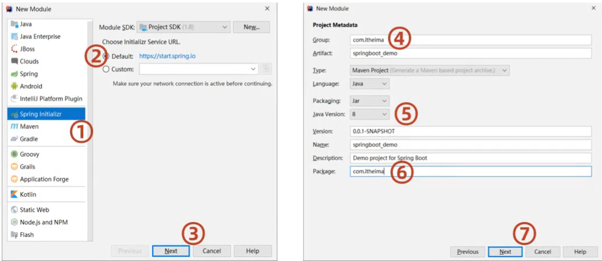
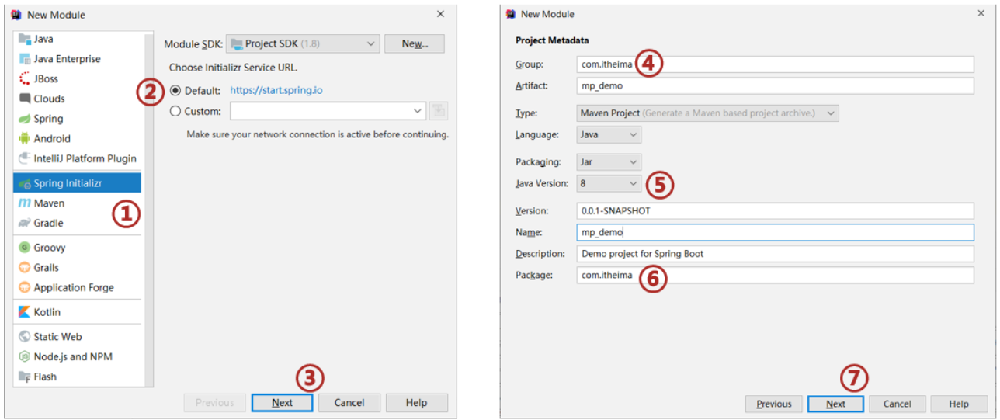
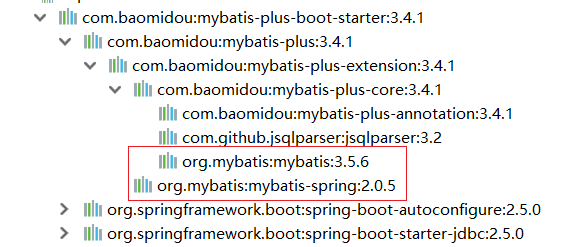
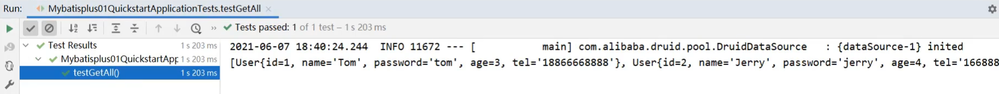

## MyBatisPlus

**今日目标**

> 基于MyBatisPlus完成标准Dao的增删改查功能
>
> 掌握MyBatisPlus中的分页及条件查询构建
>
> 掌握主键ID的生成策略
>
> 了解MyBatisPlus的代码生成器

## 1，MyBatisPlus入门案例与简介

这一节我们来学习下MyBatisPlus的入门案例与简介，这个和其他课程都不太一样，其他的课程都是先介绍概念，然后再写入门案例。而对于MyBatisPlus的学习，我们将顺序做了调整，主要的原因MyBatisPlus主要是对MyBatis的简化，所有我们先体会下它简化在哪，然后再学习它是什么，以及它帮我们都做哪些事。

### 1.1 入门案例

* MybatisPlus(简称MP)是基于MyBatis框架基础上开发的增强型工具，旨在简化开发、提供效率。

* 开发方式
  * 基于MyBatis使用MyBatisPlus
  * 基于Spring使用MyBatisPlus
  * ==基于SpringBoot使用MyBatisPlus==

SpringBoot刚刚我们学习完成，它能快速构建Spring开发环境用以整合其他技术，使用起来是非常简单，对于MP的学习，我们也基于SpringBoot来构建学习。

学习之前，我们先来回顾下，SpringBoot整合Mybatis的开发过程:

* 创建SpringBoot工程

  

* 勾选配置使用的技术，能够实现自动添加起步依赖包

  

* 设置dataSource相关属性(JDBC参数)

  

* 定义数据层接口映射配置

  

我们可以参考着上面的这个实现步骤把SpringBoot整合MyBatisPlus来快速实现下，具体的实现步骤为:

#### 步骤1:创建数据库及表

```sql
create database if not exists mybatisplus_db character set utf8;
use mybatisplus_db;
CREATE TABLE user (
    id bigint(20) primary key auto_increment,
    name varchar(32) not null,
    password  varchar(32) not null,
    age int(3) not null ,
    tel varchar(32) not null
);
insert into user values(1,'Tom','tom',3,'18866668888');
insert into user values(2,'Jerry','jerry',4,'16688886666');
insert into user values(3,'Jock','123456',41,'18812345678');
insert into user values(4,'传智播客','itcast',15,'4006184000');
```

#### 步骤2:创建SpringBoot工程



#### 步骤3:勾选配置使用技术


**说明:**

* 由于MP并未被收录到idea的系统内置配置，无法直接选择加入，需要手动在pom.xml中配置添加

#### 步骤4:pom.xml补全依赖

```xml
<dependency>
    <groupId>com.baomidou</groupId>
    <artifactId>mybatis-plus-boot-starter</artifactId>
    <version>3.4.1</version>
</dependency>
<dependency>
    <groupId>com.alibaba</groupId>
    <artifactId>druid</artifactId>
    <version>1.1.16</version>
</dependency>
```

**说明:**

* druid数据源可以加也可以不加，SpringBoot有内置的数据源，可以配置成使用Druid数据源

* 从MP的依赖关系可以看出，通过依赖传递已经将MyBatis与MyBatis整合Spring的jar包导入，我们不需要额外在添加MyBatis的相关jar包

  

#### 步骤5:添加MP的相关配置信息

resources默认生成的是properties配置文件，可以将其替换成yml文件，并在文件中配置数据库连接的相关信息:`application.yml`

```yml
spring:
  datasource:
    type: com.alibaba.druid.pool.DruidDataSource
    driver-class-name: com.mysql.cj.jdbc.Driver
    url: jdbc:mysql://localhost:3306/mybatisplus_db?serverTimezone=UTC 
    username: root
    password: root
```

**说明:**==serverTimezone是用来设置时区，UTC是标准时区，和咱们的时间差8小时，所以可以将其修改为`Asia/Shanghai`==

#### 步骤6:根据数据库表创建实体类

```java
public class User {   
    private Long id;
    private String name;
    private String password;
    private Integer age;
    private String tel;
    //setter...getter...toString方法略
}
```

#### 步骤7:创建Dao接口

```java
@Mapper
public interface UserDao extends BaseMapper<User>{
}
```

#### 步骤8:编写引导类

```java
@SpringBootApplication
//@MapperScan("com.itheima.dao")
public class Mybatisplus01QuickstartApplication {
    public static void main(String[] args) {
        SpringApplication.run(Mybatisplus01QuickstartApplication.class, args);
    }

}
```

**说明:**Dao接口要想被容器扫描到，有两种解决方案:

* 方案一:在Dao接口上添加`@Mapper`注解，并且确保Dao处在引导类所在包或其子包中
  * 该方案的缺点是需要在每一Dao接口中添加注解
* 方案二:在引导类上添加`@MapperScan`注解，其属性为所要扫描的Dao所在包
  * 该方案的好处是只需要写一次，则指定包下的所有Dao接口都能被扫描到，`@Mapper`就可以不写。

#### 步骤9:编写测试类

```java
@SpringBootTest
class MpDemoApplicationTests {

	@Autowired
	private UserDao userDao;
	@Test
	public void testGetAll() {
		List<User> userList = userDao.selectList(null);
		System.out.println(userList);
	}
}
```

**说明:**

userDao注入的时候下面有红线提示的原因是什么?

* UserDao是一个接口，不能实例化对象

* 只有在服务器启动IOC容器初始化后，由框架创建DAO接口的代理对象来注入
* 现在服务器并未启动，所以代理对象也未创建，IDEA查找不到对应的对象注入，所以提示报红
* 一旦服务启动，就能注入其代理对象，所以该错误提示不影响正常运行。

查看运行结果:



跟之前整合MyBatis相比，你会发现我们不需要在DAO接口中编写方法和SQL语句了，只需要继承`BaseMapper`接口即可。整体来说简化很多。

### 1.2 MybatisPlus简介

MyBatisPlus（简称MP）是基于MyBatis框架基础上开发的增强型工具，旨在==简化开发、提高效率==

通过刚才的案例，相信大家能够体会简化开发和提高效率这两个方面的优点。

MyBatisPlus的官网为:`https://mp.baomidou.com/`

**说明:**


现在的页面中，这一行已经被删除，现在再去访问`https://mybatis.plus`会发现访问不到，这个就有很多可能性供我们猜想了，所以大家使用baomidou的网址进行访问即可。

官方文档中有一张很多小伙伴比较熟悉的图片:


从这张图中我们可以看出MP旨在成为MyBatis的最好搭档，而不是替换MyBatis,所以可以理解为MP是MyBatis的一套增强工具，它是在MyBatis的基础上进行开发的，我们虽然使用MP但是底层依然是MyBatis的东西，也就是说我们也可以在MP中写MyBatis的内容。

对于MP的学习，大家可以参考着官方文档来进行学习，里面都有详细的代码案例。

MP的特性:

- 无侵入：只做增强不做改变，不会对现有工程产生影响
- 强大的 CRUD 操作：内置通用 Mapper，少量配置即可实现单表CRUD 操作
- 支持 Lambda：编写查询条件无需担心字段写错
- 支持主键自动生成
- 内置分页插件
- ……

## 2，标准数据层开发

在这一节中我们重点学习的是数据层标准的CRUD(增删改查)的实现与分页功能。代码比较多，我们一个个来学习。

### 2.1 标准CRUD使用

对于标准的CRUD功能都有哪些以及MP都提供了哪些方法可以使用呢?

我们先来看张图:


对于这张图的方法，我们挨个来演示下:

首先说下，案例中的环境就是咱们入门案例的内容，第一个先来完成`新增`功能

### 2.2 新增

在进行新增之前，我们可以分析下新增的方法:

```java
int insert (T t)
```

* T:泛型，新增用来保存新增数据

* int:返回值，新增成功后返回1，没有新增成功返回的是0

在测试类中进行新增操作:

```java
@SpringBootTest
class Mybatisplus01QuickstartApplicationTests {

    @Autowired
    private UserDao userDao;

    @Test
    void testSave() {
        User user = new User();
        user.setName("黑马程序员");
        user.setPassword("itheima");
        user.setAge(12);
        user.setTel("4006184000");
        userDao.insert(user);
    }
}
```

执行测试后，数据库表中就会添加一条数据。


但是数据中的主键ID，有点长，那这个主键ID是如何来的?我们更想要的是主键自增，应该是5才对，这个是我们后面要学习的主键ID生成策略，这块的这个问题，我们暂时先放放。

### 2.3 删除

在进行删除之前，我们可以分析下删除的方法:

```java
int deleteById (Serializable id)
```

