## SpringMVC_day01

**今日内容**

>* 理解SpringMVC相关概念
>* 完成SpringMVC的入门案例
>* 学会使用PostMan工具发送请求和数据
>* 掌握SpringMVC如何接收请求、数据和响应结果
>* 掌握RESTful风格及其使用
>* 完成基于RESTful的案例编写

SpringMVC是隶属于Spring框架的一部分，主要是用来进行Web开发，是对Servlet进行了封装。

对于SpringMVC我们主要学习如下内容:

* SpringMVC简介
* 请求与响应
* REST风格
* SSM整合(注解版)
* 拦截器SpringMVC是处于Web层的框架，所以其主要的作用就是用来接收前端发过来的请求和数据然后经过处理并将处理的结果响应给前端，所以如何处理请求和响应是SpringMVC中非常重要的一块内容。

REST是一种软件架构风格，可以降低开发的复杂性，提高系统的可伸缩性，后期的应用也是非常广泛。

SSM整合是把咱们所学习的SpringMVC+Spring+Mybatis整合在一起来完成业务开发，是对我们所学习这三个框架的一个综合应用。

对于SpringMVC的学习，最终要达成的目标:

1. ==掌握基于SpringMVC获取请求参数和响应json数据操作==
2. ==熟练应用基于REST风格的请求路径设置与参数传递==
3. 能够根据实际业务建立前后端开发通信协议并进行实现
4. ==基于SSM整合技术开发任意业务模块功能==

## 1，SpringMVC概述

学习SpringMVC我们先来回顾下现在web程序是如何做的，咱们现在web程序大都基于三层架构来实现。

三层架构

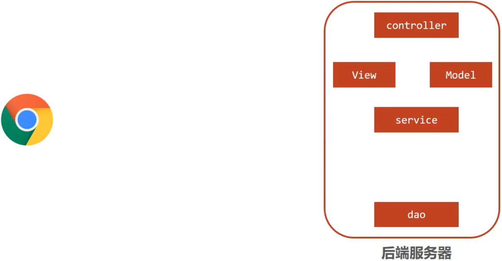

- 浏览器发送一个请求给后端服务器，后端服务器现在是使用Servlet来接收请求和数据
- 如果所有的处理都交给Servlet来处理的话，所有的东西都耦合在一起，对后期的维护和扩展极为不利
- 将后端服务器Servlet拆分成三层，分别是`web`、`service`和`dao`
  - web层主要由servlet来处理，负责页面请求和数据的收集以及响应结果给前端
  - service层主要负责业务逻辑的处理
  - dao层主要负责数据的增删改查操作
- servlet处理请求和数据的时候，存在的问题是一个servlet只能处理一个请求
- 针对web层进行了优化，采用了MVC设计模式，将其设计为`controller`、`view`和`Model`
  - controller负责请求和数据的接收，接收后将其转发给service进行业务处理
  - service根据需要会调用dao对数据进行增删改查
  - dao把数据处理完后将结果交给service,service再交给controller
  - controller根据需求组装成Model和View,Model和View组合起来生成页面转发给前端浏览器
  - 这样做的好处就是controller可以处理多个请求，并对请求进行分发，执行不同的业务操作。

通过的(controller层负责数据的请求和接受,Service负责数据的处理,Dao负责与数据库交互)

随着互联网的发展，上面的模式因为是同步调用，性能慢慢的跟不是需求，所以异步调用慢慢的走到了前台，是现在比较流行的一种处理方式。


* 因为是异步调用，所以后端不需要返回view视图，将其去除
* 前端如果通过异步调用的方式进行交互，后台就需要将返回的数据转换成json格式进行返回
* SpringMVC==主要==负责的就是
  * controller如何接收请求和数据
  * 如何将请求和数据转发给业务层
  * 如何将响应数据转换成json发回到前端

介绍了这么多，对SpringMVC进行一个定义

- SpringMVC是一种基于Java实现MVC模型的轻量级Web框架
- 优点
  - 使用简单、开发便捷(相比于Servlet)
  - 灵活性强

这里所说的优点，就需要我们在使用的过程中慢慢体会。

## 2，SpringMVC入门案例

因为SpringMVC是一个Web框架，将来是要替换Servlet,所以先来回顾下以前Servlet是如何进行开发的?

1.创建web工程(Maven结构)

2.设置tomcat服务器，加载web工程(tomcat插件)

3.导入坐标(Servlet)

4.定义处理请求的功能类(UserServlet)

5.设置请求映射(配置映射关系)

SpringMVC的制作过程和上述流程几乎是一致的，具体的实现流程是什么?

1.创建web工程(Maven结构)

2.设置tomcat服务器，加载web工程(tomcat插件)

3.导入坐标(==SpringMVC==+Servlet)

4.定义处理请求的功能类(==UserController==)

5.==设置请求映射(配置映射关系)==

6.==将SpringMVC设定加载到Tomcat容器中==

### 2.1 需求分析

### 2.2 案例制作

#### 步骤1:创建Maven项目

打开IDEA,创建一个新的web项目

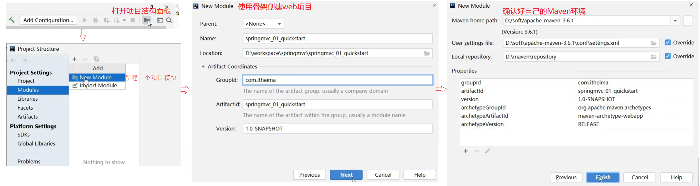

#### 步骤2:补全目录结构

因为使用骨架创建的项目结构不完整，需要手动补全

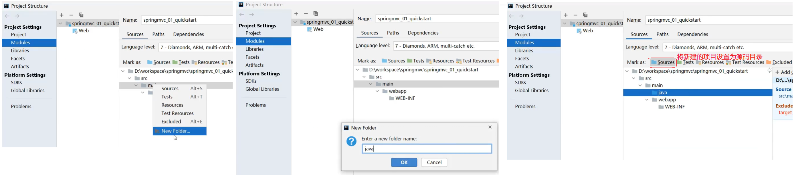

#### 步骤3:导入jar包

将pom.xml中多余的内容删除掉，再添加SpringMVC需要的依赖

```java
<?xml version="1.0" encoding="UTF-8"?>
<project xmlns="http://maven.apache.org/POM/4.0.0" xmlns:xsi="http://www.w3.org/2001/XMLSchema-instance"
  xsi:schemaLocation="http://maven.apache.org/POM/4.0.0 http://maven.apache.org/xsd/maven-4.0.0.xsd">
  <modelVersion>4.0.0</modelVersion>
  <groupId>com.itheima</groupId>
  <artifactId>springmvc_01_quickstart</artifactId>
  <version>1.0-SNAPSHOT</version>
  <packaging>war</packaging>

  <dependencies>
    <dependency>
      <groupId>javax.servlet</groupId>
      <artifactId>javax.servlet-api</artifactId>
      <version>3.1.0</version>
      <scope>provided</scope>
    </dependency>
    <dependency>
      <groupId>org.springframework</groupId>
      <artifactId>spring-webmvc</artifactId>
      <version>5.2.10.RELEASE</version>
    </dependency>
  </dependencies>

  <build>
    <plugins>
      <plugin>
        <groupId>org.apache.tomcat.maven</groupId>
        <artifactId>tomcat7-maven-plugin</artifactId>
        <version>2.1</version>
        <configuration>
          <port>80</port>
          <path>/</path>
        </configuration>
      </plugin>
    </plugins>
  </build>
</project>

```

**说明:**servlet的坐标为什么需要添加`<scope>provided</scope>`?

* scope是maven中jar包依赖作用范围的描述，
* 如果不设置默认是`compile`在在编译、运行、测试时均有效
* 如果运行有效的话就会和tomcat中的servlet-api包发生冲突，导致启动报错

* provided代表的是该包只在编译和测试的时候用，运行的时候无效直接使用tomcat中的，就避免冲突

#### 步骤4:创建配置类

```java
@Configuration
@ComponentScan("com.itheima.controller")
public class SpringMvcConfig {
}
```

#### 步骤5:创建Controller类

```java
@Controller
public class UserController {
    
    @RequestMapping("/save")
    public void save(){
        System.out.println("user save ...");
    }
}

```

#### 步骤6:使用配置类替换web.xml

将web.xml删除，换成ServletContainersInitConfig

```java
public class ServletContainersInitConfig extends AbstractDispatcherServletInitializer {
    //加载springmvc配置类
    protected WebApplicationContext createServletApplicationContext() {
        //初始化WebApplicationContext对象
        AnnotationConfigWebApplicationContext ctx = new AnnotationConfigWebApplicationContext();
        //加载指定配置类
        ctx.register(SpringMvcConfig.class);
        return ctx;
    }

    //设置由springmvc控制器处理的请求映射路径
    protected String[] getServletMappings() {
        return new String[]{"/"};
    }

    //加载spring配置类
    protected WebApplicationContext createRootApplicationContext() {
        return null;
    }
}
```

#### 步骤7:配置Tomcat环境


#### 步骤8:启动运行项目


#### 步骤9:浏览器访问

浏览器输入`http://localhost/save`进行访问，会报如下错误:

#### 

页面报错的原因是后台没有指定返回的页面，目前只需要关注控制台看`user save ...`有没有被执行即可。

#### 步骤10:修改Controller返回值解决上述问题

前面我们说过现在主要的是前端发送异步请求，后台响应json数据，所以接下来我们把Controller类的save方法进行修改

```java
@Controller
public class UserController {
    
    @RequestMapping("/save")
    public String save(){
        System.out.println("user save ...");
        return "{'info':'springmvc'}";
    }
}

```

再次重启tomcat服务器，然后重新通过浏览器测试访问,会发现还是会报错，这次的错是404


出错的原因是，如果方法直接返回字符串，springmvc会把字符串当成页面的名称在项目中进行查找返回，因为不存在对应返回值名称的页面，所以会报404错误，找不到资源。

而我们其实是想要直接返回的是json数据，具体如何修改呢?

#### 步骤11:设置返回数据为json

```java
@Controller
public class UserController {
    
    @RequestMapping("/save")
    @ResponseBody
    public String save(){
        System.out.println("user save ...");
        return "{'info':'springmvc'}";
    }
}

```

再次重启tomcat服务器，然后重新通过浏览器测试访问，就能看到返回的结果数据


至此SpringMVC的入门案例就已经完成。

(通过添加一个)

**注意事项**

* SpringMVC是基于Spring的，在pom.xml只导入了`spring-webmvc`jar包的原因是它会自动依赖spring相关坐标
* AbstractDispatcherServletInitializer类是SpringMVC提供的快速初始化Web3.0容器的抽象类
* AbstractDispatcherServletInitializer提供了三个接口方法供用户实现
  * createServletApplicationContext方法，创建Servlet容器时，加载SpringMVC对应的bean并放入WebApplicationContext对象范围中，而WebApplicationContext的作用范围为ServletContext范围，即整个web容器范围
  * getServletMappings方法，设定SpringMVC对应的请求映射路径，即SpringMVC拦截哪些请求
  * createRootApplicationContext方法，如果创建Servlet容器时需要加载非SpringMVC对应的bean,使用当前方法进行，使用方式和createServletApplicationContext相同。
  * createServletApplicationContext用来加载SpringMVC环境
  * createRootApplicationContext用来加载Spring环境

(注意createServletApplicationContext,创建Servlet容器,加载MVC环境,海洋用来加载Spring环境getServletMappings配置Serlvet路径)

### 知识点1：@Controller

| 名称 | @Controller                   |
| ---- | ----------------------------- |
| 类型 | 类注解                        |
| 位置 | SpringMVC控制器类定义上方     |
| 作用 | 设定SpringMVC的核心控制器bean |

### 知识点2：@RequestMapping

| 名称     | @RequestMapping                 |
| -------- | ------------------------------- |
| 类型     | 类注解或方法注解                |
| 位置     | SpringMVC控制器类或方法定义上方 |
| 作用     | 设置当前控制器方法请求访问路径  |
| 相关属性 | value(默认)，请求访问路径       |

### 知识点3：@ResponseBody

| 名称 | @ResponseBody                                    |
| ---- | ------------------------------------------------ |
| 类型 | 类注解或方法注解                                 |
| 位置 | SpringMVC控制器类或方法定义上方                  |
| 作用 | 设置当前控制器方法响应内容为当前返回值，无需解析 |

### 2.3 入门案例总结

- 一次性工作

  - 创建工程，设置服务器，加载工程

  - 导入坐标
  - 创建web容器启动类，加载SpringMVC配置，并设置SpringMVC请求拦截路径
  - SpringMVC核心配置类（设置配置类，扫描controller包，加载Controller控制器bean）

- 多次工作

  - 定义处理请求的控制器类
  - 定义处理请求的控制器方法，并配置映射路径（@RequestMapping）与返回json数据（@ResponseBody）

### 2.4 工作流程解析

为了更好的使用SpringMVC,我们将SpringMVC的使用过程总共分两个阶段来分析，分别是`启动服务器初始化过程`和`单次请求过程`

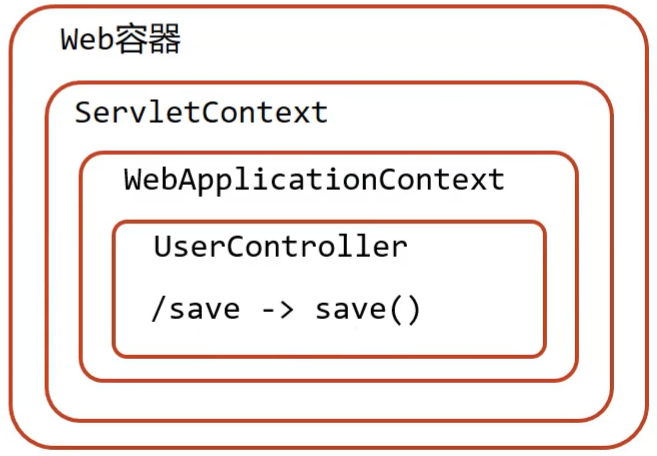

#### 2.4.1 启动服务器初始化过程

1. 服务器启动，执行ServletContainersInitConfig类，初始化web容器

   * 功能类似于以前的web.xml
2. 执行createServletApplicationContext方法，创建了WebApplicationContext对象
   - 该方法加载SpringMVC的配置类SpringMvcConfig来初始化SpringMVC的容器

3. 加载SpringMvcConfig配置类

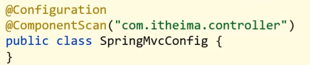

4. 执行@ComponentScan加载对应的bean
   - 执行@ComponentScan加载对应的bean

5. 加载UserController，每@RequestMapping的名称对应一个具体的方法

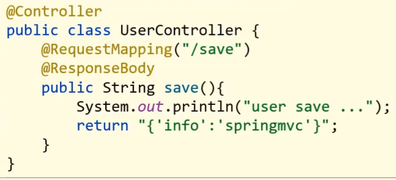

此时就建立了 `/save` 和 save方法的对应关系

执行getServletMappings方法，设定SpringMVC拦截请求的路径规则

6. 执行getServletMappings方法，设定SpringMVC拦截请求的路径规则

   

   * `/`代表所拦截请求的路径规则，只有被拦截后才能交给SpringMVC来处理请求

#### 2.4.2 单次请求过程

1. 发送请求`http://localhost/save`
2. web容器发现该请求满足SpringMVC拦截规则，将请求交给SpringMVC处理
3. 解析请求路径/save
4. 由/save匹配执行对应的方法save(）
   * 上面的第五步已经将请求路径和方法建立了对应关系，通过/save就能找到对应的save方法
5. 执行save()
6. 检测到有@ResponseBody直接将save()方法的返回值作为响应体返回给请求方


### 2.5 bean加载控制

#### 2.5.1 问题分析

入门案例的内容已经做完了，在入门案例中我们创建过一个`SpringMvcConfig`的配置类，再回想前面咱们学习Spring的时候也创建过一个配置类`SpringConfig`。这两个配置类都需要加载资源，那么它们分别都需要加载哪些内容?

我们先来看下目前我们的项目目录结构

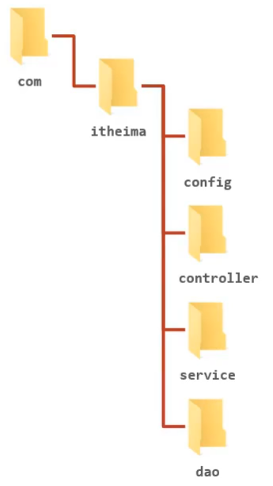

- config目录存入的是配置类,写过的配置类有:

  * ServletContainersInitConfig
  * SpringConfig
  * SpringMvcConfig
  * JdbcConfig
  * MybatisConfig

* controller目录存放的是SpringMVC的controller类
* service目录存放的是service接口和实现类
* dao目录存放的是dao/Mapper接口

controller、service和dao这些类都需要被容器管理成bean对象，那么到底是该让SpringMVC加载还是让Spring加载呢?

- SpringMVC加载其相关bean(表现层bean),也就是controller包下的类
- Spring控制的bean
  * 业务bean(Service)
  * 功能bean(DataSource,SqlSessionFactoryBean,MapperScannerConfigurer等)

分析清楚谁该管哪些bean以后，接下来要解决的问题是如何让Spring和SpringMVC分开加载各自的内容。

在SpringMVC的配置类`SpringMvcConfig`中使用注解`@ComponentScan`，我们只需要将其扫描范围设置到controller即可，如

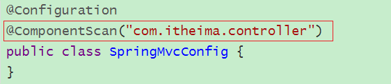

在Spring的配置类`SpringConfig`中使用注解`@ComponentScan`,当时扫描的范围中其实是已经包含了controller,如:

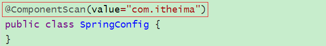

从包结构来看的话，Spring已经多把SpringMVC的controller类也给扫描到，所以针对这个问题该如何解决，就是咱们接下来要学习的内容。

概括的描述下咱们现在的问题就是==因为功能不同，如何避免Spring错误加载到SpringMVC的bean?==

#### 2.5.2 思路分析

针对上面的问题，解决方案也比较简单，就是:

* 加载Spring控制的bean的时候排除掉SpringMVC控制的bean

具体该如何排除：

* 方式一:Spring加载的bean设定扫描范围为精准范围，例如service包、dao包等
* 方式二:Spring加载的bean设定扫描范围为com.itheima,排除掉controller包中的bean
* 方式三:不区分Spring与SpringMVC的环境，加载到同一个环境中[了解即可]

#### 2.5.4 环境准备

- 创建一个Web的Maven项目

- pom.xml添加Spring依赖

  ```xml
  <?xml version="1.0" encoding="UTF-8"?>
  
  <project xmlns="http://maven.apache.org/POM/4.0.0" xmlns:xsi="http://www.w3.org/2001/XMLSchema-instance"
    xsi:schemaLocation="http://maven.apache.org/POM/4.0.0 http://maven.apache.org/xsd/maven-4.0.0.xsd">
    <modelVersion>4.0.0</modelVersion>
  
    <groupId>com.itheima</groupId>
    <artifactId>springmvc_02_bean_load</artifactId>
    <version>1.0-SNAPSHOT</version>
    <packaging>war</packaging>
  
    <dependencies>
      <dependency>
        <groupId>javax.servlet</groupId>
        <artifactId>javax.servlet-api</artifactId>
        <version>3.1.0</version>
        <scope>provided</scope>
      </dependency>
      <dependency>
        <groupId>org.springframework</groupId>
        <artifactId>spring-webmvc</artifactId>
        <version>5.2.10.RELEASE</version>
      </dependency>
      <dependency>
        <groupId>com.alibaba</groupId>
        <artifactId>druid</artifactId>
        <version>1.1.16</version>
      </dependency>
  
      <dependency>
        <groupId>org.mybatis</groupId>
        <artifactId>mybatis</artifactId>
        <version>3.5.6</version>
      </dependency>
  
      <dependency>
        <groupId>mysql</groupId>
        <artifactId>mysql-connector-java</artifactId>
        <version>5.1.47</version>
      </dependency>
  
      <dependency>
        <groupId>org.springframework</groupId>
        <artifactId>spring-jdbc</artifactId>
        <version>5.2.10.RELEASE</version>
      </dependency>
  
      <dependency>
        <groupId>org.mybatis</groupId>
        <artifactId>mybatis-spring</artifactId>
        <version>1.3.0</version>
      </dependency>
    </dependencies>
  
    <build>
      <plugins>
        <plugin>
          <groupId>org.apache.tomcat.maven</groupId>
          <artifactId>tomcat7-maven-plugin</artifactId>
          <version>2.1</version>
          <configuration>
            <port>80</port>
            <path>/</path>
          </configuration>
        </plugin>
      </plugins>
    </build>
  </project>
  
  ```

- 创建对应的配置类

  ```java
  public class ServletContainersInitConfig extends AbstractDispatcherServletInitializer {
      protected WebApplicationContext createServletApplicationContext() {
          AnnotationConfigWebApplicationContext ctx = new AnnotationConfigWebApplicationContext();
          ctx.register(SpringMvcConfig.class);
          return ctx;
      }
      protected String[] getServletMappings() {
          return new String[]{"/"};
      }
      protected WebApplicationContext createRootApplicationContext() {
        return null;
      }
  }
  
  @Configuration
  @ComponentScan("com.itheima.controller")
  public class SpringMvcConfig {
  }
  
  @Configuration
  @ComponentScan("com.itheima")
  public class SpringConfig {
  }
  
  ```

- 编写Controller，Service，Dao，Domain类

```java
@Controller
public class UserController {

    @RequestMapping("/save")
    @ResponseBody
    public String save(){
        System.out.println("user save ...");
        return "{'info':'springmvc'}";
    }
}

public interface UserService {
    public void save(User user);
}

@Service
public class UserServiceImpl implements UserService {
    public void save(User user) {
        System.out.println("user service ...");
    }
}

public interface UserDao {
    @Insert("insert into tbl_user(name,age)values(#{name},#{age})")
    public void save(User user);
}
public class User {
    private Integer id;
    private String name;
    private Integer age;
    //setter..getter..toString略
}
```

最终创建好的项目结构如下:

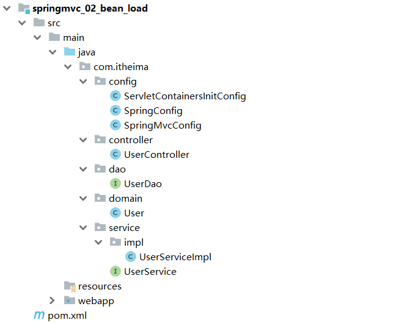

#### 2.5.5 设置bean加载控制

方式一:修改Spring配置类，设定扫描范围为精准范围。

```java
@Configuration
@ComponentScan({"com.itheima.service","comitheima.dao"})
public class SpringConfig {
}
```

**说明:**

上述只是通过例子说明可以精确指定让Spring扫描对应的包结构，真正在做开发的时候，因为Dao最终是交给`MapperScannerConfigurer`对象来进行扫描处理的，我们只需要将其扫描到service包即可。

方式二:修改Spring配置类，设定扫描范围为com.itheima,排除掉controller包中的bean

```java
@Configuration
@ComponentScan(value="com.itheima",
    excludeFilters=@ComponentScan.Filter(
    	type = FilterType.ANNOTATION,
        classes = Controller.class
    )
)
public class SpringConfig {
}
```

* excludeFilters属性：设置扫描加载bean时，排除的过滤规则

* type属性：设置排除规则，当前使用按照bean定义时的注解类型进行排除

  * ANNOTATION：按照注解排除
  * ASSIGNABLE_TYPE:按照指定的类型过滤
  * ASPECTJ:按照Aspectj表达式排除，基本上不会用
  * REGEX:按照正则表达式排除
  * CUSTOM:按照自定义规则排除

  大家只需要知道第一种ANNOTATION即可

* classes属性：设置排除的具体注解类，当前设置排除@Controller定义的bean

如何测试controller类已经被排除掉了?

```java
public class App{
	public static void main (String[] args){
        AnnotationConfigApplicationContext ctx = new AnnotationConfigApplicationContext(SpringConfig.class);
        System.out.println(ctx.getBean(UserController.class));
    }
}
```

如果被排除了，该方法执行就会报bean未被定义的错误


==注意:测试的时候，需要把SpringMvcConfig配置类上的@ComponentScan注解注释掉，否则不会报错==

出现问题的原因是，

* Spring配置类扫描的包是`com.itheima`
* SpringMVC的配置类，`SpringMvcConfig`上有一个@Configuration注解，也会被Spring扫描到
* SpringMvcConfig上又有一个@ComponentScan，把controller类又给扫描进来了
* 所以如果不把@ComponentScan注释掉，Spring配置类将Controller排除，但是因为扫描到SpringMVC的配置类，又将其加载回来，演示的效果就出不来
* 解决方案，也简单，把SpringMVC的配置类移出Spring配置类的扫描范围即可。

最后一个问题，有了Spring的配置类，要想在tomcat服务器启动将其加载，我们需要修改ServletContainersInitConfig

```java
public class ServletContainersInitConfig extends AbstractDispatcherServletInitializer {
    protected WebApplicationContext createServletApplicationContext() {
        AnnotationConfigWebApplicationContext ctx = new AnnotationConfigWebApplicationContext();
        ctx.register(SpringMvcConfig.class);
        return ctx;
    }
    protected String[] getServletMappings() {
        return new String[]{"/"};
    }
    protected WebApplicationContext createRootApplicationContext() {
      AnnotationConfigWebApplicationContext ctx = new AnnotationConfigWebApplicationContext();
        ctx.register(SpringConfig.class);
        return ctx;
    }
}
```

对于上述的配置方式，Spring还提供了一种更简单的配置方式，可以不用再去创建`AnnotationConfigWebApplicationContext`对象，不用手动`register`对应的配置类，如何实现?

```java
public class ServletContainersInitConfig extends AbstractAnnotationConfigDispatcherServletInitializer {

    protected Class<?>[] getRootConfigClasses() {
        return new Class[]{SpringConfig.class};
    }

    protected Class<?>[] getServletConfigClasses() {
        return new Class[]{SpringMvcConfig.class};
    }

    protected String[] getServletMappings() {
        return new String[]{"/"};
    }
}
```

### 知识点1：@ComponentScan

| 名称     | @ComponentScan                                               |
| -------- | ------------------------------------------------------------ |
| 类型     | 类注解                                                       |
| 位置     | 类定义上方                                                   |
| 作用     | 设置spring配置类扫描路径，用于加载使用注解格式定义的bean     |
| 相关属性 | excludeFilters:排除扫描路径中加载的bean,需要指定类别(type)和具体项(classes)<br/>includeFilters:加载指定的bean，需要指定类别(type)和具体项(classes) |

## ，PostMan工具的使用

### 3.1 PostMan简介

代码编写完后，我们要想测试，只需要打开浏览器直接输入地址发送请求即可。发送的是`GET`请求可以直接使用浏览器，但是如果要发送的是`POST`请求呢?

如果要求发送的是post请求，我们就得准备页面在页面上准备form表单，测试起来比较麻烦。所以我们就需要借助一些第三方工具，如PostMan.

* PostMan是一款功能强大的网页调试与发送网页HTTP请求的Chrome插件。
* 作用：常用于进行接口测试

* 特征
  * 简单
  * 实用
  * 美观
  * 大方

### 3.2 PostMan安装

双击`资料\Postman-win64-8.3.1-Setup.exe`即可自动安装，

安装完成后，如果需要注册，可以按照提示进行注册，如果底部有跳过测试的链接也可以点击跳过注册


看到如下界面，就说明已经安装成功。


### 3.3 PostMan使用

#### 3.3.1 创建WorkSpace工作空间


#### 3.3.2 发送请求


#### 3.3.3 保存当前请求


**注意:**第一次请求需要创建一个新的目录，后面就不需要创建新目录，直接保存到已经创建好的目录即可。

## 4，请求与响应

前面我们已经完成了入门案例相关的知识学习，接来了我们就需要针对SpringMVC相关的知识点进行系统的学习，之前我们提到过，SpringMVC是web层的框架，主要的作用是接收请求、接收数据、响应结果，所以这一章节是学习SpringMVC的==重点==内容，我们主要会讲解四部分内容:

* 请求映射路径
* 请求参数
* 日期类型参数传递
* 响应json数据

#### 4.1.1 环境准备

- 创建一个Web的Maven项目
- pom.xml添加Spring依赖

```java
<?xml version="1.0" encoding="UTF-8"?>

<project xmlns="http://maven.apache.org/POM/4.0.0" xmlns:xsi="http://www.w3.org/2001/XMLSchema-instance"
  xsi:schemaLocation="http://maven.apache.org/POM/4.0.0 http://maven.apache.org/xsd/maven-4.0.0.xsd">
  <modelVersion>4.0.0</modelVersion>

  <groupId>com.itheima</groupId>
  <artifactId>springmvc_03_request_mapping</artifactId>
  <version>1.0-SNAPSHOT</version>
  <packaging>war</packaging>

  <dependencies>
    <dependency>
      <groupId>javax.servlet</groupId>
      <artifactId>javax.servlet-api</artifactId>
      <version>3.1.0</version>
      <scope>provided</scope>
    </dependency>
    <dependency>
      <groupId>org.springframework</groupId>
      <artifactId>spring-webmvc</artifactId>
      <version>5.2.10.RELEASE</version>
    </dependency>
  </dependencies>

  <build>
    <plugins>
      <plugin>
        <groupId>org.apache.tomcat.maven</groupId>
        <artifactId>tomcat7-maven-plugin</artifactId>
        <version>2.1</version>
        <configuration>
          <port>80</port>
          <path>/</path>
        </configuration>
      </plugin>
    </plugins>
  </build>
</project>
```

- 创建对应的配置类

  ```java
  public class ServletContainersInitConfig extends AbstractAnnotationConfigDispatcherServletInitializer {
  
      protected Class<?>[] getServletConfigClasses() {
          return new Class[]{SpringMvcConfig.class};
      }
      protected String[] getServletMappings() {
          return new String[]{"/"};
      }
      protected Class<?>[] getRootConfigClasses() {
          return new Class[0];
      }
  }
  
  @Configuration
  @ComponentScan("com.itheima.controller")
  public class SpringMvcConfig {
  }
  
  ```

- 编写BookController和UserController

  ```java
  @Controller
  public class UserController {
  
      @RequestMapping("/save")
      @ResponseBody
      public String save(){
          System.out.println("user save ...");
          return "{'module':'user save'}";
      }
      
      @RequestMapping("/delete")
      @ResponseBody
      public String save(){
          System.out.println("user delete ...");
          return "{'module':'user delete'}";
      }
  }
  
  @Controller
  public class BookController {
  
      @RequestMapping("/save")
      @ResponseBody
      public String save(){
          System.out.println("book save ...");
          return "{'module':'book save'}";
      }
  }
  ```

最终创建好的项目结构如下:


把环境准备好后，启动Tomcat服务器，后台会报错:


从错误信息可以看出:

* UserController有一个save方法，访问路径为`http://localhost/save`
* BookController也有一个save方法，访问路径为`http://localhost/save`
* 当访问`http://localhost/saved`的时候，到底是访问UserController还是BookController?

#### 4.1.2 问题分析

团队多人开发，每人设置不同的请求路径，冲突问题该如何解决?

解决思路:为不同模块设置模块名作为请求路径前置

对于Book模块的save,将其访问路径设置`http://localhost/book/save`

对于User模块的save,将其访问路径设置`http://localhost/user/save`

这样在同一个模块中出现命名冲突的情况就比较少了。

#### 4.1.3 设置映射路径

##### 步骤1:修改Controller

```java
@Controller
public class UserController {

    @RequestMapping("/user/save")
    @ResponseBody
    public String save(){
        System.out.println("user save ...");
        return "{'module':'user save'}";
    }
    
    @RequestMapping("/user/delete")
    @ResponseBody
    public String save(){
        System.out.println("user delete ...");
        return "{'module':'user delete'}";
    }
}

@Controller
public class BookController {

    @RequestMapping("/book/save")
    @ResponseBody
    public String save(){
        System.out.println("book save ...");
        return "{'module':'book save'}";
    }
}
```

问题是解决了，但是每个方法前面都需要进行修改，写起来比较麻烦而且还有很多重复代码，如果/user后期发生变化，所有的方法都需要改，耦合度太高。

##### 步骤2:优化路径配置

优化方案:

```java
@Controller
@RequestMapping("/user")
public class UserController {

    @RequestMapping("/save")
    @ResponseBody
    public String save(){
        System.out.println("user save ...");
        return "{'module':'user save'}";
    }
    
    @RequestMapping("/delete")
    @ResponseBody
    public String save(){
        System.out.println("user delete ...");
        return "{'module':'user delete'}";
    }
}

@Controller
@RequestMapping("/book")
public class BookController {

    @RequestMapping("/save")
    @ResponseBody
    public String save(){
        System.out.println("book save ...");
        return "{'module':'book save'}";
    }
}
```

**注意:**

* 当类上和方法上都添加了`@RequestMapping`注解，前端发送请求的时候，要和两个注解的value值相加匹配才能访问到。
* @RequestMapping注解value属性前面加不加`/`都可以

扩展小知识:

对于PostMan如何觉得字小不好看，可以使用`ctrl+=`调大，`ctrl+-`调小。

### 4.2 请求参数

请求路径设置好后，只要确保页面发送请求地址和后台Controller类中配置的路径一致，就可以接收到前端的请求，接收到请求后，如何接收页面传递的参数?

关于请求参数的传递与接收是和请求方式有关系的，目前比较常见的两种请求方式为：

* GET
* POST

针对于不同的请求前端如何发送，后端如何接收?

#### 4.2.1 环境准备

- 创建一个Web的Maven项目

- pom.xml添加Spring依赖

  ```xml
  <?xml version="1.0" encoding="UTF-8"?>
  
  <project xmlns="http://maven.apache.org/POM/4.0.0" xmlns:xsi="http://www.w3.org/2001/XMLSchema-instance"
    xsi:schemaLocation="http://maven.apache.org/POM/4.0.0 http://maven.apache.org/xsd/maven-4.0.0.xsd">
    <modelVersion>4.0.0</modelVersion>
  
    <groupId>com.itheima</groupId>
    <artifactId>springmvc_03_request_mapping</artifactId>
    <version>1.0-SNAPSHOT</version>
    <packaging>war</packaging>
  
    <dependencies>
      <dependency>
        <groupId>javax.servlet</groupId>
        <artifactId>javax.servlet-api</artifactId>
        <version>3.1.0</version>
        <scope>provided</scope>
      </dependency>
      <dependency>
        <groupId>org.springframework</groupId>
        <artifactId>spring-webmvc</artifactId>
        <version>5.2.10.RELEASE</version>
      </dependency>
    </dependencies>
  
    <build>
      <plugins>
        <plugin>
          <groupId>org.apache.tomcat.maven</groupId>
          <artifactId>tomcat7-maven-plugin</artifactId>
          <version>2.1</version>
          <configuration>
            <port>80</port>
            <path>/</path>
          </configuration>
        </plugin>
      </plugins>
    </build>
  </project>
  
  ```

- 创建对应的配置类

  ```java
  public class ServletContainersInitConfig extends AbstractAnnotationConfigDispatcherServletInitializer {
  
      protected Class<?>[] getServletConfigClasses() {
          return new Class[]{SpringMvcConfig.class};
      }
      protected String[] getServletMappings() {
          return new String[]{"/"};
      }
      protected Class<?>[] getRootConfigClasses() {
          return new Class[0];
      }
  }
  
  @Configuration
  @ComponentScan("com.itheima.controller")
  public class SpringMvcConfig {
  }
  
  ```

- 编写UserController

  ```java
  @Controller
  public class UserController {
  
      @RequestMapping("/commonParam")
      @ResponseBody
      public String commonParam(){
          return "{'module':'commonParam'}";
      }
  }
  ```

* 编写模型类，User和Address

  ```java
  public class Address {
      private String province;
      private String city;
      //setter...getter...略
  }
  public class User {
      private String name;
      private int age;
      //setter...getter...略
  }
  ```

最终创建好的项目结构如下:


#### 4.2.2 参数传递

##### GET发送单个参数

发送请求与参数:

```java
http://localhost/commonParam?name=itcast
```

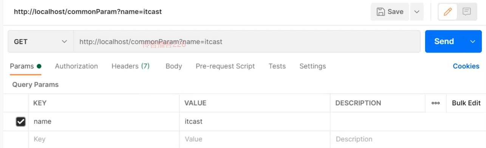

接收参数：

```java
@Controller
public class UserController {

    @RequestMapping("/commonParam")
    @ResponseBody
    public String commonParam(String name){
        System.out.println("普通参数传递 name ==> "+name);
        return "{'module':'commonParam'}";
    }
}
```

##### GET发送多个参数

发送请求与参数:

```
http://localhost/commonParam?name=itcast&age=15
```


接收参数：

```java
@Controller
public class UserController {

    @RequestMapping("/commonParam")
    @ResponseBody
    public String commonParam(String name,int age){
        System.out.println("普通参数传递 name ==> "+name);
        System.out.println("普通参数传递 age ==> "+age);
        return "{'module':'commonParam'}";
    }
}
```

##### GET请求中文乱码

如果我们传递的参数中有中文，你会发现接收到的参数会出现中文乱码问题。

发送请求:`http://localhost/commonParam?name=张三&age=18`

控制台:

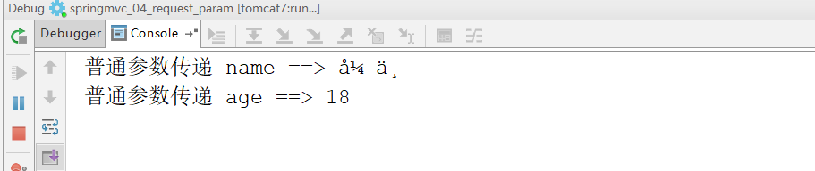

出现乱码的原因相信大家都清楚，Tomcat8.5以后的版本已经处理了中文乱码的问题，但是IDEA中的Tomcat插件目前只到Tomcat7，所以需要修改pom.xml来解决GET请求中文乱码问题

```xml
<build>
    <plugins>
      <plugin>
        <groupId>org.apache.tomcat.maven</groupId>
        <artifactId>tomcat7-maven-plugin</artifactId>
        <version>2.1</version>
        <configuration>
          <port>80</port><!--tomcat端口号-->
          <path>/</path> <!--虚拟目录-->
          <uriEncoding>UTF-8</uriEncoding><!--访问路径编解码字符集-->
        </configuration>
      </plugin>
    </plugins>
  </build>
```

##### POST发送参数

发送请求与参数:

接收参数：

和GET一致，不用做任何修改

```java
@Controller
public class UserController {

    @RequestMapping("/commonParam")
    @ResponseBody
    public String commonParam(String name,int age){
        System.out.println("普通参数传递 name ==> "+name);
        System.out.println("普通参数传递 age ==> "+age);
        return "{'module':'commonParam'}";
    }
}
```

##### POST请求中文乱码

发送请求与参数:


接收参数:

控制台打印，会发现有中文乱码问题。


解决方案:配置过滤器

```java
public class ServletContainersInitConfig extends AbstractAnnotationConfigDispatcherServletInitializer {
    protected Class<?>[] getRootConfigClasses() {
        return new Class[0];
    }

    protected Class<?>[] getServletConfigClasses() {
        return new Class[]{SpringMvcConfig.class};
    }

    protected String[] getServletMappings() {
        return new String[]{"/"};
    }

    //乱码处理
    @Override
    protected Filter[] getServletFilters() {
        CharacterEncodingFilter filter = new CharacterEncodingFilter();
        filter.setEncoding("UTF-8");
        return new Filter[]{filter};
    }
}
```

CharacterEncodingFilter是在spring-web包中，所以用之前需要导入对应的jar包。

### 4.3 五种类型参数传递

前面我们已经能够使用GET或POST来发送请求和数据，所携带的数据都是比较简单的数据，接下来在这个基础上，我们来研究一些比较复杂的参数传递，常见的参数种类有:

* 普通参数
* POJO类型参数
* 嵌套POJO类型参数
* 数组类型参数
* 集合类型参数

这些参数如何发送，后台改如何接收?我们一个个来学习。

#### 4.3.1 普通参数

* 普通参数:url地址传参，地址参数名与形参变量名相同，定义形参即可接收参数。


如果形参与地址参数名不一致该如何解决?

发送请求与参数:

```java
http://localhost/commonParamDifferentName?name=张三&age=18
```

后台接收参数:

```java
@RequestMapping("/commonParamDifferentName")
@ResponseBody
public String commonParamDifferentName(String userName , int age){
    System.out.println("普通参数传递 userName ==> "+userName);
    System.out.println("普通参数传递 age ==> "+age);
    return "{'module':'common param different name'}";
}
```

因为前端给的是`name`,后台接收使用的是`userName`,两个名称对不上，导致接收数据失败:

因为前端给的是`name`,后台接收使用的是`userName`,两个名称对不上，导致接收数据失败:


解决方案:使用@RequestParam注解

```java
@RequestMapping("/commonParamDifferentName")
    @ResponseBody
    public String commonParamDifferentName(@RequestPaam("name") String userName , int age){
        System.out.println("普通参数传递 userName ==> "+userName);
        System.out.println("普通参数传递 age ==> "+age);
        return "{'module':'common param different name'}";
    }
```

**注意:写上@RequestParam注解框架就不需要自己去解析注入，能提升框架处理性能**

#### 4.3.2 POJO数据类型

简单数据类型一般处理的是参数个数比较少的请求，如果参数比较多，那么后台接收参数的时候就比较复杂，这个时候我们可以考虑使用POJO数据类型。

- POJO参数：请求参数名与形参对象属性名相同，定义POJO类型形参即可接收参数

此时需要使用前面准备好的POJO类，先来看下User

```java
public class User {
    private String name;
    private int age;
    //setter...getter...略
}
```

发送请求和参数:


后台接收参数:

```java
//POJO参数：请求参数与形参对象中的属性对应即可完成参数传递
@RequestMapping("/pojoParam")
@ResponseBody
public String pojoParam(User user){
    System.out.println("pojo参数传递 user ==> "+user);
    return "{'module':'pojo param'}";
}
```

**注意:**

* POJO参数接收，前端GET和POST发送请求数据的方式不变。
* ==请求参数key的名称要和POJO中属性的名称一致，否则无法封装。==

#### 4.3.3 嵌套POJO类型参数

如果POJO对象中嵌套了其他的POJO类，如

```java
public class Address {
    private String province;
    private String city;
    //setter...getter...略
}
public class User {
    private String name;
    private int age;
    private Address address;
    //setter...getter...略
}
```

* 嵌套POJO参数：请求参数名与形参对象属性名相同，按照对象层次结构关系即可接收嵌套POJO属性参数

发送请求和参数:

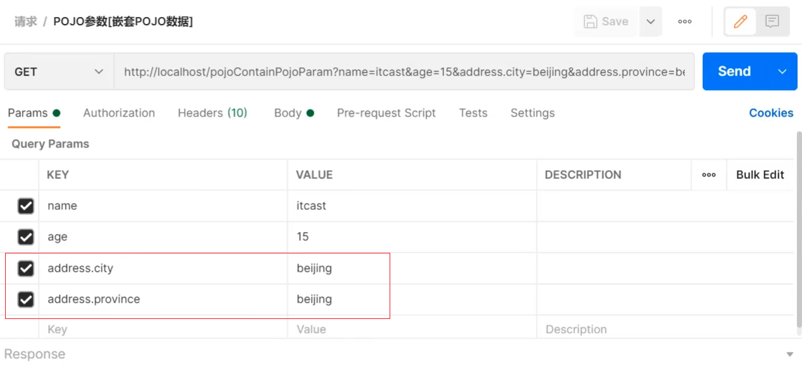

后台接收参数:

```java
//POJO参数：请求参数与形参对象中的属性对应即可完成参数传递
@RequestMapping("/pojoParam")
@ResponseBody
public String pojoParam(User user){
    System.out.println("pojo参数传递 user ==> "+user);
    return "{'module':'pojo param'}";
}
```

**注意:**

==请求参数key的名称要和POJO中属性的名称一致，否则无法封装==

#### 4.3.4 数组类型参数

举个简单的例子，如果前端需要获取用户的爱好，爱好绝大多数情况下都是多个，如何发送请求数据和接收数据呢?

- 数组参数：请求参数名与形参对象属性名相同且请求参数为多个，定义数组类型即可接收参数

发送请求和参数:

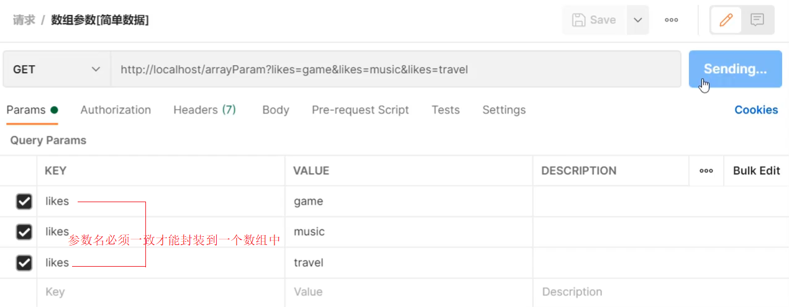

后台接收参数:

```java
  //数组参数：同名请求参数可以直接映射到对应名称的形参数组对象中
    @RequestMapping("/arrayParam")
    @ResponseBody
    public String arrayParam(String[] likes){
        System.out.println("数组参数传递 likes ==> "+ Arrays.toString(likes));
        return "{'module':'array param'}";
    }
```

#### 4.3.5 集合类型参数

数组能接收多个值，那么集合是否也可以实现这个功能呢?

发送请求和参数:


后台接收参数:

```java
//集合参数：同名请求参数可以使用@RequestParam注解映射到对应名称的集合对象中作为数据
@RequestMapping("/listParam")
@ResponseBody
public String listParam(List<String> likes){
    System.out.println("集合参数传递 likes ==> "+ likes);
    return "{'module':'list param'}";
}
```

运行会报错，


错误的原因是:SpringMVC将List看做是一个POJO对象来处理，将其创建一个对象并准备把前端的数据封装到对象中，但是List是一个接口无法创建对象，所以报错。

解决方案是:使用`@RequestParam`注解

```java
//集合参数：同名请求参数可以使用@RequestParam注解映射到对应名称的集合对象中作为数据
@RequestMapping("/listParam")
@ResponseBody
public String listParam(@RequestParam List<String> likes){
    System.out.println("集合参数传递 likes ==> "+ likes);
    return "{'module':'list param'}";
}
```

* 集合保存普通参数：请求参数名与形参集合对象名相同且请求参数为多个，@RequestParam绑定参数关系
* 对于简单数据类型使用数组会比集合更简单些。

### 知识点1：@RequestParam

| 名称     | @RequestParam                                          |
| -------- | ------------------------------------------------------ |
| 类型     | 形参注解                                               |
| 位置     | SpringMVC控制器方法形参定义前面                        |
| 作用     | 绑定请求参数与处理器方法形参间的关系                   |
| 相关参数 | required：是否为必传参数 <br/>defaultValue：参数默认值 |

### 4.4 JSON数据传输参数

前面我们说过，现在比较流行的开发方式为异步调用。前后台以异步方式进行交换，传输的数据使用的是==JSON==,所以前端如果发送的是JSON数据，后端该如何接收?

对于JSON数据类型，我们常见的有三种:

- json普通数组（["value1","value2","value3",...]）
- json对象（{key1:value1,key2:value2,...}）
- json对象数组（[{key1:value1,...},{key2:value2,...}]）

对于上述数据，前端如何发送，后端如何接收?

#### JSON普通数组

###### 步骤1:pom.xml添加依赖

SpringMVC默认使用的是jackson来处理json的转换，所以需要在pom.xml添加jackson依赖

```xml
<dependency>
    <groupId>com.fasterxml.jackson.core</groupId>
    <artifactId>jackson-databind</artifactId>
    <version>2.9.0</version>
</dependency>
```

###### 步骤2:PostMan发送JSON数据


###### 步骤3:开启SpringMVC注解支持

在SpringMVC的配置类中开启SpringMVC的注解支持，这里面就包含了将JSON转换成对象的功能。

```java
@Configuration
@ComponentScan("com.itheima.controller")
//开启json数据类型自动转换
@EnableWebMvc
public class SpringMvcConfig {
}
```

###### 步骤4:参数前添加@RequestBody

```java
//使用@RequestBody注解将外部传递的json数组数据映射到形参的集合对象中作为数据
@RequestMapping("/listParamForJson")
@ResponseBody
public String listParamForJson(@RequestBody List<String> likes){
    System.out.println("list common(json)参数传递 list ==> "+likes);
    return "{'module':'list common for json param'}";
}
```

###### 步骤5:启动运行程序


JSON普通数组的数据就已经传递完成，下面针对JSON对象数据和JSON对象数组的数据该如何传递呢?

#### JSON对象数据

我们会发现，只需要关注请求和数据如何发送?后端数据如何接收?

请求和数据的发送:

```json
{
	"name":"itcast",
	"age":15
}
```


后端接收数据：

```java
@RequestMapping("/pojoParamForJson")
@ResponseBody
public String pojoParamForJson(@RequestBody User user){
    System.out.println("pojo(json)参数传递 user ==> "+user);
    return "{'module':'pojo for json param'}";
}
```

启动程序访问测试


**说明:**

address为null的原因是前端没有传递数据给后端。

如果想要address也有数据，我们需求修改前端传递的数据内容:

```json
{
	"name":"itcast",
	"age":15,
    "address":{
        "province":"beijing",
        "city":"beijing"
    }
}
```

再次发送请求，就能看到address中的数据


#### JSON对象数组

集合中保存多个POJO该如何实现?

请求和数据的发送:

```json
[
    {"name":"itcast","age":15},
    {"name":"itheima","age":12}
]
```

 

后端接收数据:

```java
@RequestMapping("/listPojoParamForJson")
@ResponseBody
public String listPojoParamForJson(@RequestBody List<User> list){
    System.out.println("list pojo(json)参数传递 list ==> "+list);
    return "{'module':'list pojo for json param'}";
}
```

启动程序访问测试


**小结**

SpringMVC接收JSON数据的实现步骤为:

(1)导入jackson包

(2)使用PostMan发送JSON数据

(3)开启SpringMVC注解驱动，在配置类上添加@EnableWebMvc注解

(4)Controller方法的参数前添加@RequestBody注解


#### 知识点1：@EnableWebMvc

| 名称 | @EnableWebMvc             |
| ---- | ------------------------- |
| 类型 | ==配置类注解==            |
| 位置 | SpringMVC配置类定义上方   |
| 作用 | 开启SpringMVC多项辅助功能 |

#### 知识点2：@RequestBody

| 名称 | @RequestBody                                                 |
| ---- | ------------------------------------------------------------ |
| 类型 | ==形参注解==                                                 |
| 位置 | SpringMVC控制器方法形参定义前面                              |
| 作用 | 将请求中请求体所包含的数据传递给请求参数，此注解一个处理器方法只能使用一次 |

#### @RequestBody与@RequestParam区别

* 区别
  * @RequestParam用于接收url地址传参，表单传参【application/x-www-form-urlencoded】
  * @RequestBody用于接收json数据【application/json】

* 应用
  * 后期开发中，发送json格式数据为主，@RequestBody应用较广
  * 如果发送非json格式数据，选用@RequestParam接收请求参数

(有五种参数类型

分别是

1. 普通参数(拼接在地址值后面的),通过@RequestParam解决
2. POJO类型参数(实体类对象)通过@RequestMapping("/pojoParam")
   @ResponseBody
3. 嵌套POJO类型参数(一个POJO当中还有其他POJO,例如用户当中可能会有地址属性)(类似)
4. 数组(通过arrayParms)
5. 集合类型(需要加@RequestParam)

### 知识点1：@RequestParam

| 名称     | @RequestParam                                          |
| -------- | ------------------------------------------------------ |
| 类型     | 形参注解                                               |
| 位置     | SpringMVC控制器方法形参定义前面                        |
| 作用     | 绑定请求参数与处理器方法形参间的关系                   |
| 相关参数 | required：是否为必传参数 <br/>defaultValue：参数默认值 |

### 4.4 JSON数据传输参数

前面我们说过，现在比较流行的开发方式为异步调用。前后台以异步方式进行交换，传输的数据使用的是==JSON==,所以前端如果发送的是JSON数据，后端该如何接收?

对于JSON数据类型，我们常见的有三种:

- json普通数组（["value1","value2","value3",...]）
- json对象（{key1:value1,key2:value2,...}）
- json对象数组（[{key1:value1,...},{key2:value2,...}]）

对于上述数据，前端如何发送，后端如何接收?

#### JSON普通数组

###### 步骤1:pom.xml添加依赖

SpringMVC默认使用的是jackson来处理json的转换，所以需要在pom.xml添加jackson依赖

```xml
<dependency>
    <groupId>com.fasterxml.jackson.core</groupId>
    <artifactId>jackson-databind</artifactId>
    <version>2.9.0</version>
</dependency>
```

###### 步骤2:PostMan发送JSON数据


###### 步骤3:开启SpringMVC注解支持

在SpringMVC的配置类中开启SpringMVC的注解支持，这里面就包含了将JSON转换成对象的功能。

```java
@Configuration
@ComponentScan("com.itheima.controller")
//开启json数据类型自动转换
@EnableWebMvc
public class SpringMvcConfig {
}
```

###### 步骤4:参数前添加@RequestBody

```java
//使用@RequestBody注解将外部传递的json数组数据映射到形参的集合对象中作为数据
@RequestMapping("/listParamForJson")
@ResponseBody
public String listParamForJson(@RequestBody List<String> likes){
    System.out.println("list common(json)参数传递 list ==> "+likes);
    return "{'module':'list common for json param'}";
}
```

###### 步骤5:启动运行程序


JSON普通数组的数据就已经传递完成，下面针对JSON对象数据和JSON对象数组的数据该如何传递呢?

#### JSON对象数据

我们会发现，只需要关注请求和数据如何发送?后端数据如何接收?

请求和数据的发送:

```json
{
	"name":"itcast",
	"age":15
}
```


后端接收数据：

```java
@RequestMapping("/pojoParamForJson")
@ResponseBody
public String pojoParamForJson(@RequestBody User user){
    System.out.println("pojo(json)参数传递 user ==> "+user);
    return "{'module':'pojo for json param'}";
}
```

启动程序访问测试


**说明:**

address为null的原因是前端没有传递数据给后端。

如果想要address也有数据，我们需求修改前端传递的数据内容:

```json
{
	"name":"itcast",
	"age":15,
    "address":{
        "province":"beijing",
        "city":"beijing"
    }
}
```

再次发送请求，就能看到address中的数据


#### JSON对象数组

集合中保存多个POJO该如何实现?

请求和数据的发送:

```json
[
    {"name":"itcast","age":15},
    {"name":"itheima","age":12}
]
```

 

后端接收数据:

```java
@RequestMapping("/listPojoParamForJson")
@ResponseBody
public String listPojoParamForJson(@RequestBody List<User> list){
    System.out.println("list pojo(json)参数传递 list ==> "+list);
    return "{'module':'list pojo for json param'}";
}
```

启动程序访问测试


**小结**

SpringMVC接收JSON数据的实现步骤为:

(1)导入jackson包

(2)使用PostMan发送JSON数据

(3)开启SpringMVC注解驱动，在配置类上添加@EnableWebMvc注解

(4)Controller方法的参数前添加@RequestBody注解

#### 知识点1：@EnableWebMvc

| 名称 | @EnableWebMvc             |
| ---- | ------------------------- |
| 类型 | ==配置类注解==            |
| 位置 | SpringMVC配置类定义上方   |
| 作用 | 开启SpringMVC多项辅助功能 |

#### 知识点2：@RequestBody

| 名称 | @RequestBody                                                 |
| ---- | ------------------------------------------------------------ |
| 类型 | ==形参注解==                                                 |
| 位置 | SpringMVC控制器方法形参定义前面                              |
| 作用 | 将请求中请求体所包含的数据传递给请求参数，此注解一个处理器方法只能使用一次 |

#### @RequestBody与@RequestParam区别

* 区别
  * @RequestParam用于接收url地址传参，表单传参【application/x-www-form-urlencoded】
  * @RequestBody用于接收json数据【application/json】

* 应用
  * 后期开发中，发送json格式数据为主，@RequestBody应用较广
  * 如果发送非json格式数据，选用@RequestParam接收请求参数

(当发送的是json用@RequestBody,如果发送的是非json格式数据,就使用RequestParams接收)

### 4.5 日期类型参数传递

前面我们处理过简单数据类型、POJO数据类型、数组和集合数据类型以及JSON数据类型，接下来我们还得处理一种开发中比较常见的一种数据类型，`日期类型`

日期类型比较特殊，因为对于日期的格式有N多中输入方式，比如:

* 2088-08-18
* 2088/08/18
* 08/18/2088
* ......

针对这么多日期格式，SpringMVC该如何接收，它能很好的处理日期类型数据么?

#### 步骤1:编写方法接收日期数据

在UserController类中添加方法，把参数设置为日期类型

```java
@RequestMapping("/dataParam")
@ResponseBody
public String dataParam(Date date)
    System.out.println("参数传递 date ==> "+date);
    return "{'module':'data param'}";
}
```

#### 步骤2:启动Tomcat服务器

查看控制台是否报错，如果有错误，先解决错误。

#### 步骤3:使用PostMan发送请求

使用PostMan发送GET请求，并设置date参数

`http://localhost/dataParam?date=2088/08/08`


#### 步骤4:查看控制台


通过打印，我们发现SpringMVC可以接收日期数据类型，并将其打印在控制台。

这个时候，我们就想如果把日期参数的格式改成其他的，SpringMVC还能处理么?

#### 步骤5:更换日期格式

为了能更好的看到程序运行的结果，我们在方法中多添加一个日期参数

```java
@RequestMapping("/dataParam")
@ResponseBody
public String dataParam(Date date,Date date1)
    System.out.println("参数传递 date ==> "+date);
    return "{'module':'data param'}";
}
```

使用PostMan发送请求，携带两个不同的日期格式，

`http://localhost/dataParam?date=2088/08/08&date1=2088-08-08`


发送请求和数据后，页面会报400，控制台会报出一个错误

Resolved [org.springframework.web.method.annotation.==MethodArgumentTypeMismatchException==: Failed to convert value of type 'java.lang.String' to required type 'java.util.Date'; nested exception is org.springframework.core.convert.==ConversionFailedException==: Failed to convert from type [java.lang.String] to type [java.util.Date] for value '2088-08-08'; nested exception is java.lang.IllegalArgumentException]

从错误信息可以看出，错误的原因是在将`2088-08-08`转换成日期类型的时候失败了，原因是SpringMVC默认支持的字符串转日期的格式为`yyyy/MM/dd`,而我们现在传递的不符合其默认格式，SpringMVC就无法进行格式转换，所以报错。

解决方案也比较简单，需要使用`@DateTimeFormat`

```java
@RequestMapping("/dataParam")
@ResponseBody
public String dataParam(Date date,
                        @DateTimeFormat(pattern="yyyy-MM-dd") Date date1)
    System.out.println("参数传递 date ==> "+date);
	System.out.println("参数传递 date1(yyyy-MM-dd) ==> "+date1);
    return "{'module':'data param'}";
}
```

重新启动服务器，重新发送请求测试，SpringMVC就可以正确的进行日期转换了


#### 步骤6:携带时间的日期

接下来我们再来发送一个携带时间的日期，看下SpringMVC该如何处理?

先修改UserController类，添加第三个参数

```java
@RequestMapping("/dataParam")
@ResponseBody
public String dataParam(Date date,
                        @DateTimeFormat(pattern="yyyy-MM-dd") Date date1,
                        @DateTimeFormat(pattern="yyyy/MM/dd HH:mm:ss") Date date2)
    System.out.println("参数传递 date ==> "+date);
	System.out.println("参数传递 date1(yyyy-MM-dd) ==> "+date1);
	System.out.println("参数传递 date2(yyyy/MM/dd HH:mm:ss) ==> "+date2);
    return "{'module':'data param'}";
}
```

使用PostMan发送请求，携带两个不同的日期格式，

`http://localhost/dataParam?date=2088/08/08&date1=2088-08-08&date2=2088/08/08 8:08:08`


重新启动服务器，重新发送请求测试，SpringMVC就可以将日期时间的数据进行转换

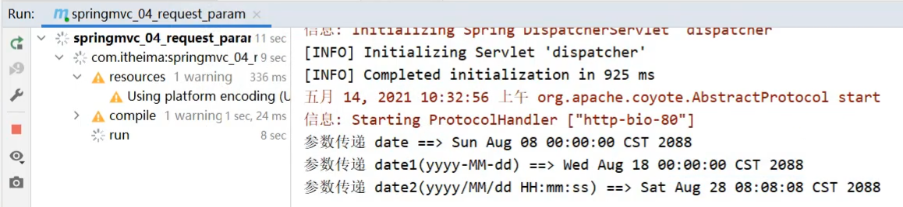


#### 知识点1：@DateTimeFormat

| 名称     | @DateTimeFormat                 |
| -------- | ------------------------------- |
| 类型     | ==形参注解==                    |
| 位置     | SpringMVC控制器方法形参前面     |
| 作用     | 设定日期时间型数据格式          |
| 相关属性 | pattern：指定日期时间格式字符串 |

#### 内部实现原理

讲解内部原理之前，我们需要先思考个问题:

* 前端传递字符串，后端使用日期Date接收
* 前端传递JSON数据，后端使用对象接收
* 前端传递字符串，后端使用Integer接收
* 后台需要的数据类型有很多中
* 在数据的传递过程中存在很多类型的转换